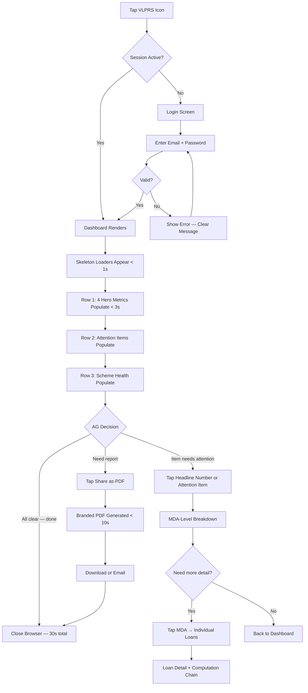
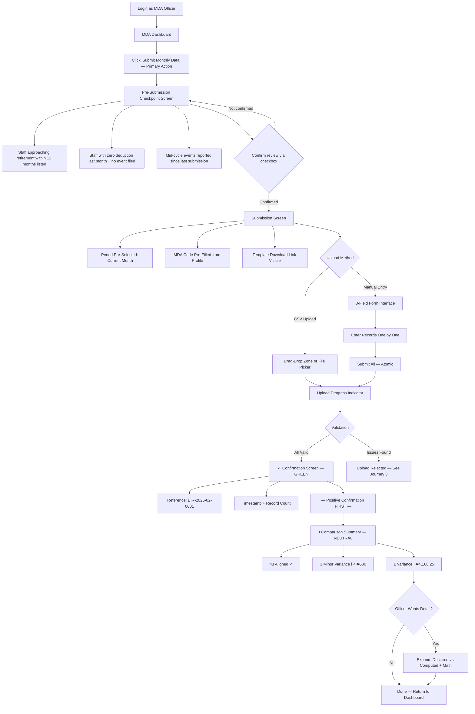
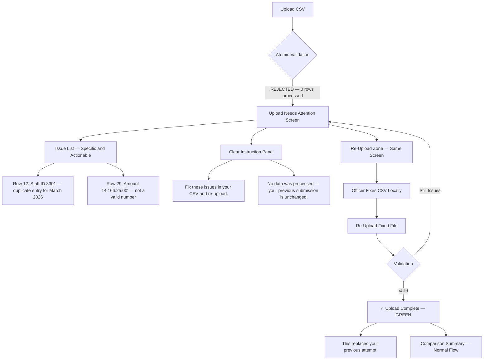
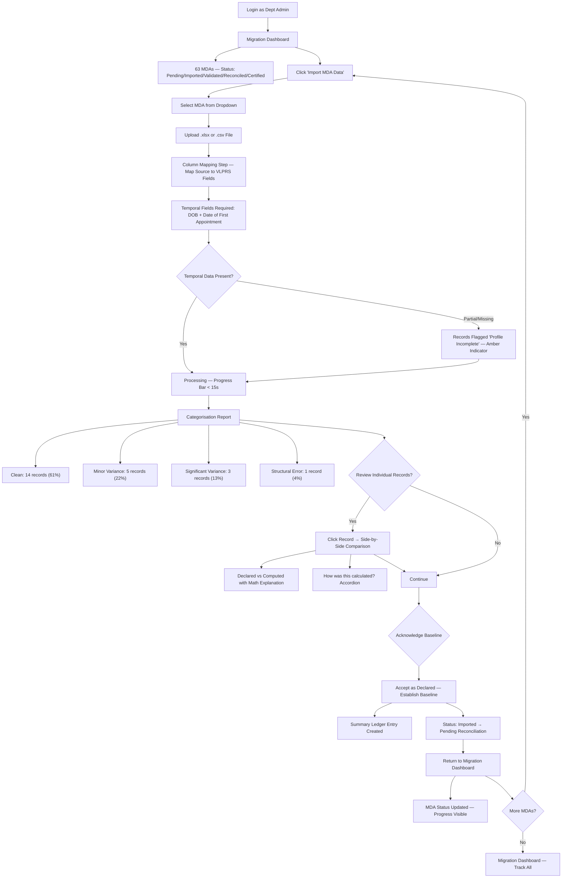
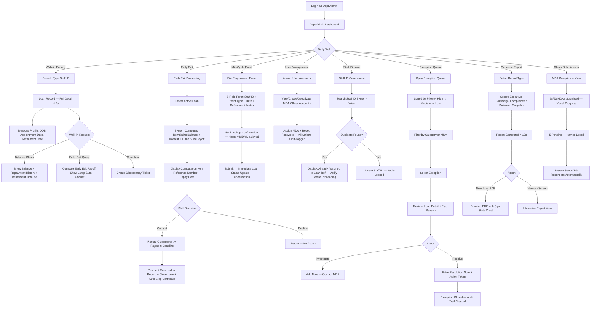
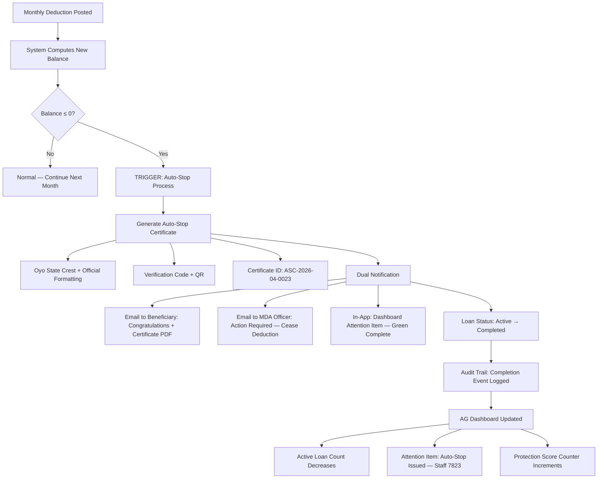

# UX Design Specification VLPRS

**Author:** Awwal
**Date:** 2026-02-15

---

## Executive Summary

### Project Vision

VLPRS (Vehicle Loan Processing & Receivables System) is a secure, mobile-first web application replacing fragmented spreadsheet-based vehicle loan administration across 63 Oyo State Government MDAs with a single computation-authoritative digital system of record. The core UX principle: MDAs submit facts (8 fields — 6 core plus conditional event date and cessation reason), the system computes truth (balances, interest, exceptions, retirement timelines), and the AG sees reality (instant executive dashboard). The system must feel like institutional relief — not surveillance — to drive adoption across a workforce primed to distrust new government IT.

### Target Users

Five distinct user profiles with fundamentally different interaction patterns, device preferences, session durations, and emotional needs — from the AG's 30-second mobile glance to the Department Admin's all-day desktop operations. The UX must serve a tech-savvy executive on a phone and a career civil servant on a desktop with equal fluency. Non-punitive design language is an adoption requirement, not a style preference.

| User | Primary Device | Session Pattern | Core UX Need |
|------|---------------|----------------|--------------|
| Accountant General (Super Admin) | Phone (4G) | 30-second glances | Instant confidence — answer any question without clicking |
| Deputy AG (Super Admin — Power User) | Desktop | 45-minute deep-dives | Drill-down control — catch problems before they escalate |
| Department Admin | Desktop | All-day operational | Efficiency — search, annotate, resolve, report in seconds |
| MDA Reporting Officers (x63) | Office desktop | 15-minute monthly | Simplicity and safety — submit 8 fields (with conditional logic) without blame |
| Beneficiaries (3,100+, Phase 2) | Phone | Occasional check-ins | Transparency and protection — see where money goes |

### Key Design Challenges

1. **Dual-device paradigm:** Mobile-first executive dashboard (AG's phone on 4G, <3s load) coexisting with desktop-optimised data workflows (migration, exception queues, reports). Two interaction models, one coherent system.
2. **Non-punitive tone as architectural constraint:** Iconography, colour, microcopy, and interaction patterns must consistently reinforce neutral comparison language. No warning icons for variances. No red for discrepancies. Information icons and amber attention indicators only.
3. **Tech-literacy spectrum:** System must be intuitive for a tech-savvy AG navigating fintech apps and a 55-year-old MDA officer using a web dashboard for the first time — without separate UIs or condescending simplification.
4. **Trust-building through transparency:** Visible computation chains, mathematical explanations for every variance, and no hidden automated actions. Every number must feel verifiable.
5. **Data density management:** Executive dashboards, 16-column loan snapshots, 5-category migration reports, and exception queues — all must be scannable without overwhelming. Progressive disclosure is the primary strategy.

### Design Opportunities

1. **The 30-Second Dashboard:** A zero-interaction mobile executive experience that becomes the AG's most-opened screen — and the system's political shield.
2. **Progressive disclosure architecture:** Headlines → MDA detail → individual loans. Same data at three depths, serving AG, Deputy AG, and Department Admin without separate interfaces.
3. **The Comparison View pattern:** Side-by-side declared vs computed values with mathematical explanation — turning potential confrontation into education.
4. **Migration as empowerment:** Framing 15 years of accumulated variance as "baseline establishment" rather than "error exposure" — the UX that determines whether MDAs adopt or resist.
5. **Auto-Stop Certificate as emotional climax:** Premium UX treatment for the moment a loan hits zero — the system's most powerful trust-building event and the "never over-deducted again" guarantee made tangible.

## Core User Experience

### Defining Experience

VLPRS has two defining interactions that serve its dual-value proposition:

**The Flagship — AG Dashboard ("Glance and Know"):** Open the dashboard on a phone, see four headline numbers (Active Loans, Total Exposure, Fund Available, Monthly Recovery), answer any executive question without a single click. This zero-interaction experience must load in <3 seconds on 4G. It is the system's political shield — if the AG depends on it every morning, VLPRS is institutionally untouchable.

**The Workhorse — MDA Submission ("Submit Facts and Leave"):** Review the pre-submission checkpoint, upload an 8-field CSV (6 core fields plus conditional event date and cessation reason), receive a confirmation with reference number and row count, see a neutral comparison summary, close the browser. 15 minutes instead of half a day. This is the adoption engine — if 63 MDA officers find VLPRS easier than their 17-column spreadsheets, resistance collapses through peer advocacy.

### Platform Strategy

- **Architecture:** SPA with Public Zone (unauthenticated landing, scheme information) and Protected Zone (role-based dashboard experience)
- **Mobile-first** for executive dashboard views — AG's phone on Nigerian 4G is the primary design constraint
- **Desktop-optimised** for data-heavy workflows — migration tool, exception queues, 16-column loan snapshots, detailed reports
- **Responsive breakpoints:** Mobile (<768px), Tablet (768-1024px), Desktop (>1024px)
- **PWA:** Basic installability only — home screen icon via manifest + service worker, no complex offline caching
- **Browser support:** Modern evergreen browsers only (Chrome, Firefox, Edge, Safari, Brave, Opera — latest 2 versions)
- **No native mobile app** — responsive SPA serves all device needs without app store friction

### Effortless Interactions

| Interaction | Target | Effort Level |
|-------------|--------|-------------|
| AG checks scheme status | 4 headline numbers + early exit/gratuity secondary metrics on first render, <3s on 4G | Zero — no clicks, no scrolling |
| AG shares report | One tap → branded PDF with Oyo State crest, or one tap → email with PDF attachment | One action |
| MDA officer monthly submission | Review pre-submission checkpoint → upload 8-field CSV → confirmation in <10 seconds | Checkpoint review + one file + one click |
| MDA officer mid-cycle event | File employment event (5 fields) → immediate loan status update + confirmation | One form, one click |
| Dept Admin loan lookup | Type staff ID → complete record + temporal profile + retirement timeline in <2 seconds | One search |
| Dept Admin early exit | Compute payoff → record commitment → record payment → loan closed + Auto-Stop | Three-step guided workflow |
| Dept Admin weekly report | Select report → PDF in <10 seconds | Three clicks |
| Auto-Stop Certificate | System detects zero balance → generates certificate → notifies MDA + beneficiary | Fully automatic — zero human effort |
| Submission reminders | System sends T-3, T-2, T-1 email reminders | Fully automatic |
| Inactive loan detection | System flags loans with no deduction for 60+ days | Fully automatic |
| Post-retirement detection | System flags staff with active deductions past computed retirement date | Fully automatic |
| Early exit expiry | System marks expired computations, flags uncommitted commitments | Fully automatic |

### Critical Success Moments

1. **"The Commissioner Call" (AG, Day 1):** AG answers a fund status question from her phone in real time. Dashboard loads in <3 seconds with accurate numbers. Failure here = permanent trust loss.
2. **"The First Submission" (MDA Officer, Week 1):** First CSV upload processes in <10 seconds with clean confirmation and neutral comparison summary. Failure here = peer network spreads "don't bother."
3. **"The Migration Reveal" (Dept Admin, Week 1):** 15 years of MDA data categorised without blame — "Comparison Complete," not "Errors Found." Failure here = migration stalls, project delayed.
4. **"The Auto-Stop Moment" (Beneficiary, Ongoing):** Loan hits zero, system generates certificate, MDA notified to cease deductions. The "never over-deducted again" guarantee made tangible. The emotional climax of the system.
5. **"The Pattern Catch" (Deputy AG, Ongoing):** Growing variance trend spotted and resolved before it reaches the AG's desk. VLPRS proving it discovers what was previously invisible.

### Experience Principles

1. **Zero-Click Truth:** Information hierarchy delivers answers before interaction. Headlines, attention items, and scheme health visible on first render. Drill-down adds depth; it is never required for understanding.
2. **Facts In, Truth Out:** Clear visual separation between what humans provide (facts, context, decisions) and what the system computes (balances, schedules, variances). Users never calculate. Users never edit computed values.
3. **Neutral by Default:** Every icon, colour, word, and animation reinforces comparison — not accusation. Information icons for variances. Amber for attention. "Comparison" not "error." This principle has absolute authority over all visual design choices.
4. **Mobile-First, Desktop-Complete:** Executive dashboard designed phone-first, scales up. Data workflows designed desktop-first, degrade gracefully. Neither compromises the other.
5. **Progressive Disclosure:** Same data at three depths — headlines (AG), MDA detail (Deputy AG), individual records (Dept Admin). Each role accesses their natural depth without navigating through others' views.

## Desired Emotional Response

### Primary Emotional Goals

Each role has a distinct primary emotion that VLPRS must deliver to drive adoption and sustained use:

| Role | Primary Emotion | The Crystallising Moment |
|------|----------------|------------------------|
| Accountant General | **Command** — "I know the answer instantly" | Answering the Commissioner's fund status call from her phone in real time |
| Deputy AG | **Vigilance** — "I see the pattern before it escalates" | Catching a growing MDA variance trend before it reaches the AG's desk |
| Department Admin | **Relief + Pride** — "My knowledge matters, my burden is lifted" | Generating a report in 5 seconds instead of 3 days |
| MDA Officers (x63) | **Safety** — "I submitted facts, nobody is blaming me" | Seeing "Comparison Complete" with information icons, not "Errors Found" with warnings |
| Beneficiaries (3,100+) | **Protection** — "The system guarantees my deductions will stop" | Receiving the Auto-Stop Certificate when loan reaches zero |

### Emotional Journey Mapping

| Stage | Target Emotion | Anti-Pattern to Prevent |
|-------|---------------|------------------------|
| First encounter (training/demo) | "This isn't threatening — it's actually easier" | "This will expose my mistakes" |
| First real use | "That was simple. I'm done already." | "I don't understand what I'm looking at" |
| Variance revealed | "I'm being informed, not accused" | "The system caught my error" |
| Exception flagged | "This needs attention — here's the context" | "Something is wrong and it's my fault" |
| Routine use (month 3+) | "I couldn't go back to the old way" | "This is just another system to manage" |
| Error/failure (upload rejected) | "Clear problem, clear fix, try again" | "What went wrong? Who do I call?" |
| Loan completion | "The system protected me. I have proof." | Silence — no notification, no certainty |

### Micro-Emotions

Five emotional axes where VLPRS must consistently land on the positive side:

1. **Confidence over Confusion:** Every number has a visible computation chain. Every variance has a mathematical explanation. No black boxes, no unexplained figures.
2. **Trust over Skepticism:** The system shows its work — side-by-side comparisons with math, not just assertions. Expandable "how was this calculated?" sections.
3. **Relief over Anxiety:** Upload confirmation with reference number = "it's done." Neutral comparison language = "nobody is watching me." Clear error messages = "I know exactly what to fix."
4. **Pride over Shame:** Variances framed as inherited system characteristics, not personal failures. "Administrative variance" language preserves professional dignity.
5. **Control over Helplessness:** AG drills down at will. MDA officer sees exactly what was submitted. Dept Admin annotates context. Every role has agency over their domain.

### Design Implications

| Desired Emotion | UX Design Approach |
|----------------|-------------------|
| Command (AG) | Zero-interaction dashboard — headline numbers rendered first, no loading spinners blocking content, one-tap PDF sharing |
| Safety (MDA Officers) | Information icons only (never warning/error icons for variances), amber attention indicators (never red), "Comparison Complete" headers, submission reference numbers |
| Relief (Dept Admin) | Instant search (<2s), one-click report generation, persistent annotation fields for institutional memory |
| Trust (All users) | Visible computation chains, side-by-side declared vs computed with math, expandable calculation detail |
| Protection (Beneficiaries) | Auto-Stop Certificate with official Oyo State branding, QR verification code, dual notification (beneficiary + MDA) |
| Control (Deputy AG) | Drill-down from any headline number, exception flagging with priority/category, filter and sort on every data table |
| Dignity (MDA Officers) | "Administrative variance" language throughout, no MDA league tables or rankings, no red/green performance comparisons between MDAs |

### Emotional Design Principles

1. **Inform, Never Accuse:** The system surfaces facts and comparisons. It never assigns fault. Language, iconography, and colour must pass the "would this make an MDA officer defensive?" test. If yes, redesign.
2. **Confirm, Then Compare:** Every submission gets immediate positive confirmation ("Received. Reference: BIR-2026-02-0001") before any variance is shown. The user's contribution is acknowledged first.
3. **Explain, Don't Assert:** Every computed number should be traceable. "Your balance is ₦305,822.50 because..." is always available. Trust is built through transparency, not authority.
4. **Celebrate Protection:** The Auto-Stop Certificate is a moment of celebration — not a quiet system event. Premium visual treatment, official branding, clear language. Every certificate is proof the system works.
5. **Fail Gently:** When something goes wrong (upload rejected, validation failure), the system is specific ("Row 12: Staff ID 3301 appears twice"), actionable ("Remove the duplicate and re-upload"), and blame-free (no "Error" headers — use "Upload needs attention").

## UX Pattern Analysis & Inspiration

### Inspiring Products Analysis

**1. Stripe Dashboard (Fintech Data Standard):**
Hero metrics render instantly without loading spinners. Progressive disclosure from summary to transaction detail. Clean typographic hierarchy for large numbers. Status uses colour + text. *Transferable:* AG dashboard structure — headline numbers as hero content, drill-down to MDA detail, then individual loans.

**2. Wise/TransferWise (Transparent Computation):**
Step-by-step fee calculation breakdowns build trust. Side-by-side comparison with mathematical explanation. Educational, neutral tone for financial information. *Transferable:* Comparison View pattern (declared vs computed), "how was this calculated?" expandable sections, trust through visible computation chains.

**3. Kuda/GTBank Mobile (Nigerian Banking Context):**
Balance as hero number. Transaction history with date/amount/status. Statement PDF download. Familiar to VLPRS target users. *Transferable:* Naira formatting (₦1,840,000.00), balance display pattern, PDF statement download, mobile banking mental model for beneficiary dashboard (Phase 2).

**4. GOV.UK Design System (Government Accessibility):**
One task per page. Plain language. Consistent components. WCAG AA accessible by default. Status tags with colour + text. *Transferable:* MDA submission wizard (one step per screen), plain-language error messages, migration status tags, accessibility-first component design.

**5. Linear (Exception Management):**
Priority-sorted queues. Category filtering. Clean status transitions. Keyboard-navigable. Dense information without clutter. *Transferable:* Exception queue (priority, category, MDA filter), migration dashboard status tracking, attention items with priority indicators.

### Transferable UX Patterns

| Pattern | Source | VLPRS Application |
|---------|--------|-------------------|
| Hero metrics (large, immediate render) | Stripe, Kuda | AG Dashboard — 4 headline numbers |
| Progressive drill-down | Stripe | Dashboard → MDA → Individual loan |
| Expandable calculation detail | Wise | Variance comparison, loan balance |
| Side-by-side comparison | Wise | Declared vs Computed view |
| One task per page wizard | GOV.UK | MDA submission, migration tool |
| Status tags (colour + text) | GOV.UK, Linear | Migration status, exception priority |
| Priority-sorted queue with filters | Linear | Exception queue, attention items |
| Balance as hero number | Kuda/GTBank | Dashboard headlines, loan detail |
| PDF download/share | Kuda/GTBank | Reports, Auto-Stop Certificate |
| Atomic confirmation (reference + timestamp) | Banking apps | Submission confirmation |

### Anti-Patterns to Avoid

| Anti-Pattern | Reason to Avoid |
|-------------|----------------|
| Red/green RAG without text labels | Fails accessibility, feels accusatory |
| Warning/error icons for variances | Triggers defensive response, violates "Neutral by Default" principle |
| MDA league tables or rankings | Creates blame dynamics, destroys adoption |
| Dense data tables as default view | Overwhelms non-technical users |
| Loading spinners blocking content | AG needs <3s render; use skeleton loaders instead |
| Multi-step wizard for simple submissions | MDA officers need one upload, one confirmation |
| Enterprise admin panel aesthetic | Signals "not built for me" to government users |
| Hidden computation (opaque numbers) | Government workers distrust what they can't verify |

### Design Inspiration Strategy

**Adopt Directly:**
- Hero metrics pattern (Stripe) for AG dashboard headline numbers
- Atomic confirmation pattern (banking) for MDA submission receipts
- Status tags with colour + text (GOV.UK) for migration tracking and exception priority
- PDF download/share pattern (Kuda) for report sharing and certificates

**Adapt for VLPRS Context:**
- Wise's calculation transparency → VLPRS "how was this calculated?" sections (adapted for loan computation, not currency conversion)
- Linear's priority queue → VLPRS exception queue (adapted with non-punitive language and neutral iconography)
- GOV.UK one-task-per-page → VLPRS submission wizard (simplified for 8-field CSV context with conditional fields, not multi-page government forms)
- Stripe's drill-down → VLPRS progressive disclosure (adapted for 3-tier government hierarchy: AG → MDA → individual)

**Avoid Entirely:**
- Any pattern that ranks, scores, or compares MDAs against each other
- Enterprise admin panel aesthetics (dark sidebars, small fonts, cramped layouts)
- Red colour for any data variance or discrepancy indicator
- Warning/error iconography for comparison results

## Design System Foundation

### Design System Choice

**Primary:** shadcn/ui + Tailwind CSS
**Component primitives:** Radix UI (accessibility-first headless components)
**Styling engine:** Tailwind CSS (utility-first, responsive, minimal bundle)
**Approach:** Themeable system — pre-built components with full brand customisation

### Rationale for Selection

1. **Solo developer velocity:** Copy-paste components owned by the project (not npm dependencies). Add incrementally — only install components actually used.
2. **Fintech visual quality:** Produces clean, modern UI that meets the "not government grey" quality bar without requiring a dedicated designer. Subtle shadows, clean typography, purposeful whitespace.
3. **Accessibility by default:** Radix UI primitives provide WCAG 2.1 AA compliance at the foundation level — keyboard navigation, screen reader support, focus management, ARIA attributes built in.
4. **Full brand customisation:** Theme configuration controls all design tokens (colours, typography, spacing, border radius, shadows). Oyo State branding and government-appropriate colour palette applied through CSS variables.
5. **Data-heavy component support:** Tables with sorting/filtering/pagination, charts, forms, dialogs, command palette, toast notifications — all patterns required by VLPRS dashboards, exception queues, and reports.
6. **Performance alignment:** Tailwind's utility CSS produces minimal bundle sizes, supporting the <3 second mobile dashboard load requirement. No unused component CSS shipped.

### Implementation Approach

**Component Installation Strategy:**
- Install components incrementally as screens are built (not all upfront)
- Priority component set for MVP:
  - **Dashboard:** Card, Badge, Table, Chart containers, Skeleton loaders
  - **Forms:** Input, Select, Button, Label, Form validation, File upload
  - **Navigation:** Sidebar, Tabs, Breadcrumb, Command (search)
  - **Feedback:** Toast, Alert, Dialog, Sheet (mobile panels)
  - **Data display:** Table, Badge, Separator, Accordion (expandable detail)

**Theme Configuration:**
- CSS variables for all design tokens (colours, spacing, radius, fonts)
- Light mode primary (dark mode deferred to Phase 2 if needed)
- Government-appropriate colour palette defined once, applied everywhere
- Naira currency formatting helper (₦1,840,000.00 style)

### Customization Strategy

**Brand Layer (VLPRS-Specific):**
- Primary colour: Government-appropriate professional blue/teal (not generic grey)
- Accent colour: Amber for attention items (aligned with "Neutral by Default" principle)
- Success colour: Green for completions and certificates only
- Danger colour: Used ONLY for destructive actions (delete, cancel) — never for data variances
- Typography: System font stack (Inter or similar clean sans-serif) for performance
- Oyo State Government crest: SVG asset for PDF reports and certificates

**Component Overrides:**
- Status badges: Colour + icon + text (never colour alone) — aligned with accessibility requirements
- Variance indicators: Information icon (circle-i) only — no warning triangles or error crosses
- Table rows: Neutral hover state, no red/green row colouring for data quality
- Mobile dashboard: Hero metric cards full-width, stacked vertically
- Desktop data views: Dense table mode with comfortable row height

**Non-Punitive Design Tokens:**
- `--variance-bg`: Soft neutral (light blue-grey) — not red or yellow
- `--variance-icon`: Information circle (ℹ) — not warning triangle (⚠)
- `--variance-text`: "Comparison" / "Variance" — never "Error" / "Warning"
- `--attention-bg`: Amber/warm neutral — not red
- `--attention-label`: "Attention" / "Review" — never "Alert" / "Critical"

## Defining Core Experience

### The Defining Interaction

**"Open. See Truth. Act."** — VLPRS's core experience in three words.

The AG Dashboard is the defining experience. If the Accountant General depends on VLPRS every morning to know the State's loan portfolio position, the system is politically protected and institutionally permanent. Every other user's experience flows from that protection.

Per-role defining moments:
- **AG:** "I open my phone and see exactly where the portfolio stands — right now."
- **MDA Officer:** "I upload one file, and I'm done for the month."
- **Dept Admin:** "I type a staff ID, and everything about that loan appears instantly."

### User Mental Models

Users arrive with existing mental models from apps they already use daily. VLPRS matches these models rather than imposing new paradigms:

| User | Mental Model | Familiar Analogy |
|------|-------------|-----------------|
| AG | Check portfolio like checking bank balance | Banking app — open, see balance, done |
| Deputy AG | Investigate data like reviewing evidence | Spreadsheet power user — filter, sort, drill |
| Dept Admin | Look up records, manage cases, export reports | Case management — search, update, export |
| MDA Officer | Submit a file to a government portal | File upload — select, upload, confirm |
| Beneficiary | Check loan like checking account statement | Mobile banking statement view |

### Success Criteria

| Criterion | Target | Rationale |
|-----------|--------|-----------|
| Time to truth (AG) | <3 seconds to 4 headline numbers | 30-second scenario requires instant dashboard |
| Time to done (MDA Officer) | <60 seconds login to confirmation | Must feel faster than Excel to drive adoption |
| Time to record (Dept Admin) | <2 seconds search to result | Faster than walking to a filing cabinet |
| Zero-learn dashboard | AG reads headlines without training | Numbers must be self-explanatory through labels and formatting |
| Error recovery | <4 minutes from rejection to re-upload | Clean failure enables fast recovery |
| Comparison clarity | Self-explanatory through layout alone | Declared vs computed understood without training |

### Novel UX Patterns

Three genuinely novel patterns for government financial systems:

1. **Non-Punitive Variance Display:** Discrepancies presented as neutral educational comparisons using information icons, amber tones, and "Comparison Complete" framing. No existing government system does this — and it's the reason MDAs will adopt instead of resist. Requires careful visual calibration: if even one element feels accusatory, trust breaks.

2. **Computation Transparency Accordion:** "How was this calculated?" expandable sections on any computed balance. Shows complete derivation: ledger entries → formula → result. Adapted from Wise's fee transparency, applied to government loan amortisation. Builds trust through visible math, not authority.

3. **Auto-Stop Certificate UX:** System-generated official government document (branded, QR-verified) triggered automatically when balance computation hits zero. The transition from "data state" to "official document" within the same UI must feel momentous — premium visual treatment, celebration moment, not routine system event.

### Experience Mechanics

**AG Dashboard Flow:**

| Step | Action | System Response | Duration |
|------|--------|----------------|----------|
| 1. Open | Tap VLPRS icon on phone | Session check → Dashboard or Login | <1s |
| 2. First Render | Wait | Skeleton loaders → Hero metrics populate with subtle count-up animation | <3s |
| 3. Passive Scan | Eyes scan rows 2-3 | Attention items + scheme health indicators populate | +2s |
| 4. Decision | All green? Close. Item needs attention? Tap. | Drill-down: headline → MDA → loan → computation chain | Variable |
| 5. Action (optional) | Tap "Share as PDF" | Branded report generated → download/email | <10s |

**MDA Submission Flow:**

| Step | Action | System Response | Duration |
|------|--------|----------------|----------|
| 1. Login | Enter credentials | Dashboard with "Submit Monthly Data" as primary action | <3s |
| 2. Upload | Drag CSV or click file picker | Progress indicator → processing indicator | <10s |
| 3. Confirmation | Read | "Upload Complete" + reference number + timestamp + row count | Immediate |
| 4. Comparison | Scan | "Comparison Summary" — aligned records (checkmark), variances (info icon) | Immediate |
| 5. Done | Close browser | No required action on variances — logged, not assigned | 0s |

**Dept Admin Loan Lookup Flow:**

| Step | Action | System Response | Duration |
|------|--------|----------------|----------|
| 1. Search | Type staff ID in search bar | Instant results as-you-type | <2s |
| 2. View | Click result | Full loan record: master data, repayment history, status, annotations | <1s |
| 3. Explore (optional) | Expand "How was this calculated?" | Complete computation chain from ledger entries | <1s |
| 4. Act (optional) | Add annotation / flag exception / generate report | Action confirmed with toast notification | <2s |

## Visual Design Foundation

### Color System

**Palette Story:** Crimson + Gold = Oyo State heritage. Teal = modern fintech energy. Neutral greys = data without emotion.

**Primary — Oyo State Heritage:**
- `#9C1E23` Oyo Crimson — sidebar, header, primary buttons, brand identity
- `#7A181D` Crimson Dark — hover/active states, depth
- `#B83338` Crimson Medium — secondary brand applications
- `#FCECED` Crimson 50 — light tint for selected states

**Secondary — Complementary Teal (Modern Fintech):**
- `#0D7377` Deep Teal — links, secondary actions, data highlights, info icons
- `#10969B` Teal — hover states, active indicators
- `#E0F5F5` Teal 50 — tint backgrounds, info panels

**Tertiary — Heritage Gold:**
- `#B8860B` Dark Gold — premium accents, certificate elements
- `#D4A017` Gold — attention items, highlights
- `#FDF8E8` Gold 50 — attention item backgrounds

**Semantic Colours (Non-Punitive, Data-Level):**
- Success `#16A34A` — ONLY for loan completion, Auto-Stop Certificate, "Aligned" records
- Attention `#D4A017` (Heritage Gold) — attention items, review needed (warm, not alarming)
- Variance `#6B7280` (Neutral Grey) — comparison panels, variance backgrounds (deliberately neutral)
- Danger `#DC2626` — ONLY for destructive actions (delete, cancel). Visually distinct from brand crimson. NEVER for data variances
- Info `#0D7377` (Deep Teal) — information icons, expandable sections, computation detail

**Surface Colours:**
- Background: `#FFFFFF` | Surface: `#F8FAFC` | Border: `#E2E8F0`
- Text Primary: `#1E293B` | Text Secondary: `#64748B` | Text Muted: `#94A3B8`

**Chrome vs Content Separation (Non-Punitive Enforcement):**
Brand crimson lives exclusively in the UI chrome (sidebar, header, primary buttons) — communicating "This is an official Oyo State Government system." The data content area uses only neutral colours (white, slate, grey, teal, gold) — communicating "Here are the numbers, without judgment." No crimson in data indicators, variance displays, or comparison panels.

| Context | Colour | Icon |
|---------|--------|------|
| Variance indicator | Neutral grey `#6B7280` background | Teal info circle (ℹ) |
| Attention item | Gold `#D4A017` badge | Gold dot or flag |
| Aligned record | Green `#16A34A` text/badge | Green checkmark |
| MDA not yet submitted | Teal `#0D7377` "Pending" badge | Teal clock |
| Auto-Stop Certificate | Green celebration + Gold premium accent | Green shield |
| Dashboard hero metrics | Primary text on white surface | No emotional colour |
| Sidebar/header | Oyo Crimson `#9C1E23` | White text/icons |
| Primary action buttons | Oyo Crimson `#9C1E23` fill | White text |

### Typography System

**Font Stack:** Inter (variable) with JetBrains Mono for financial figures in tables.
**Fallback:** -apple-system, BlinkMacSystemFont, 'Segoe UI', sans-serif

**Type Scale:**

| Role | Size | Weight | Usage |
|------|------|--------|-------|
| Hero Metric | 36px / 2.25rem | Bold | Dashboard headline numbers (₦1,840,000.00) |
| H1 | 30px / 1.875rem | Semibold | Page titles |
| H2 | 24px / 1.5rem | Semibold | Section headings |
| H3 | 20px / 1.25rem | Medium | Subsection headings |
| H4 | 16px / 1rem | Semibold | Card headers, table headers |
| Body | 16px / 1rem | Regular | Primary content |
| Body Small | 14px / 0.875rem | Regular | Table cells, secondary content |
| Caption | 12px / 0.75rem | Regular | Timestamps, metadata |

**Number Formatting:** ₦1,840,000.00 (Naira symbol + thousands separator + 2 decimal places). `font-variant-numeric: tabular-nums` for column alignment in tables.

**Line Heights:** Headings 1.2 (tight), Body 1.5 (comfortable), Captions 1.4 (compact), Hero metrics 1.0 (numbers only).

### Spacing & Layout Foundation

**Spacing Scale:** 4px base unit. Key increments: 8px (compact), 16px (standard), 24px (section), 32px (major break), 48px (page sections).

**Layout Grid:** 12-column on desktop (max-width 1280px), single column on mobile. Sidebar 256px fixed on desktop (Oyo Crimson background), sheet overlay on mobile.

**Component Dimensions:**
- Card border radius: 8px | Button/input radius: 6px
- Button height: 40px desktop, 48px mobile
- Table row height: 48px minimum | Touch targets: 44x44px minimum
- Shadows: shadow-sm for cards, shadow-md for modals only

**Responsive Breakpoints:**
- Mobile (<768px): Single column, stacked hero metrics, hamburger menu, crimson header bar
- Tablet (768-1024px): 2-column metrics, collapsible sidebar
- Desktop (>1024px): Full grid, fixed crimson sidebar, dense data tables, side-by-side comparisons

### Accessibility Considerations

- Text contrast: Primary text `#1E293B` on white = 12.6:1 (exceeds WCAG AA)
- Secondary text: `#64748B` on white = 4.6:1 (meets WCAG AA)
- Sidebar text: White `#FFFFFF` on Crimson `#9C1E23` = 7.2:1 (exceeds WCAG AA)
- Focus indicators: 2px solid Deep Teal `#0D7377` ring on all interactive elements
- Colour independence: All status indicators use colour + icon + text (never colour alone)
- Font minimum: 16px base prevents mobile browser zoom
- Number legibility: Tabular figures + monospace option for financial columns
- Touch targets: 44x44px minimum on all interactive elements

## Design Direction

### Design Directions Explored

Six complementary design directions were generated as interactive HTML mockups (`ux-design-directions.html`), each demonstrating the Oyo Crimson palette applied to a key VLPRS screen:

1. **AG Executive Dashboard (Desktop):** Crimson sidebar navigation, neutral white content area, 4 hero metric cards, attention items with gold "Review" badges, scheme health panel. Progressive disclosure from headlines to drill-down.
2. **AG Mobile Dashboard (Phone):** Crimson header bar, full-width stacked metric cards, compact attention items, one-tap "Share as PDF" button. Optimised for 4G, <3 second render.
3. **MDA Submission Flow:** Centred submission card, drag-drop upload zone (teal accent on hover), green confirmation box shown FIRST, then neutral "Comparison Summary" with info icons. Expandable variance detail with mathematical explanation.
4. **Comparison View (Declared vs Computed):** Novel split-panel pattern — white left panel for MDA-declared values, teal-tinted right panel for system-computed values. Bottom bar shows difference with blue info icon and mathematical explanation. Expandable "How was this calculated?" accordion.
5. **Auto-Stop Certificate:** Premium celebration treatment — gold border, Oyo State crest (crimson), green success panel, structured details table, QR verification code. The system's most emotionally significant output.
6. **Migration Dashboard:** Five-metric progress bar (Total, Certified, Reconciled, Imported, Pending), status table with colour-coded dots (green=Certified, teal=Reconciled, gold=Imported, grey=Pending), categorisation columns (Clean, Minor, Significant, Structural).

### Chosen Direction

**Unified design system** — all 6 directions are complementary views of a single coherent design language:

- **Chrome zone (brand):** Oyo Crimson `#9C1E23` for sidebar, header, primary action buttons
- **Content zone (data):** White/slate neutral backgrounds for all data presentation
- **Semantic indicators:** Gold for attention, teal for information, green for success/completion, grey for neutral/pending
- **No crimson in data:** Brand colour never appears in data indicators, variance displays, or comparison panels

### Design Rationale

1. **Institutional legitimacy:** Crimson sidebar immediately signals "Oyo State Government" — no mistaking this for a generic dashboard
2. **Non-punitive enforcement:** Chrome/content separation ensures data presentation stays emotionally neutral while the brand remains authoritative
3. **Fintech quality:** Clean typography (Inter), subtle shadows, purposeful whitespace, tabular number formatting — meets the "not government grey" quality bar
4. **Consistent language:** Same component patterns (cards, badges, tables, status dots) applied across all screens — learn once, recognise everywhere

### Implementation Notes

- HTML mockup file: `_bmad-output/planning-artifacts/ux-design-directions.html`
- All colour values use CSS custom properties for theme consistency
- Components map directly to shadcn/ui equivalents (Card, Badge, Table, Button, Dialog)
- Mobile dashboard layout tested at 375px width (iPhone SE/standard)

### CANONICAL VISUAL REFERENCE

**`_bmad-output/planning-artifacts/ux-design-directions.html` is the binding visual reference for all VLPRS UI implementation.** This interactive HTML mockup was presented to and approved by the client team during a live demo. All implementing agents, developers, and stories MUST follow the visual patterns established in this file:

1. **No deviation** from the approved visual design without explicit client sign-off
2. **Component styles** — card borders, shadows, border-radius, padding, typography sizes — must match the HTML mockup pixel-for-pixel where shadcn/ui allows
3. **Colour application** — Oyo Crimson (`#9C1E23`) for sidebar/header/primary buttons only; neutral surfaces for data content; gold for attention; teal for info; green for success/completion only; red for destructive actions only (never for data variances)
4. **Layout structure** — 256px crimson sidebar (desktop), crimson header bar (mobile), neutral `#F8FAFC` content area, hero metrics as the first rendered content
5. **Badge patterns** — `badge-attention` (gold), `badge-info` (teal), `badge-success` (green), status dots with text labels
6. **Table patterns** — uppercase header text, `tabular-nums` for financial columns, hover row highlight, status dots with colour + text
7. **Non-punitive enforcement** — information icons (ℹ) for variances (never warning triangles), "Comparison Summary" headers (never "Errors Found"), amber/gold for attention (never red)
8. **Certificate treatment** — gold border, crimson crest, green success panel, structured detail table, QR placeholder

**This directive applies to every story that produces UI output.** When a story's acceptance criteria describe a screen or component, the implementing agent should open `ux-design-directions.html` and verify visual alignment before marking the story as complete.

**New screens not covered by the 6 directions** (e.g., User Management, Profile page) must follow the same design language: crimson sidebar, neutral content area, same card/table/badge/button patterns, same typography and spacing.

## User Journey Flows

### Journey 1: AG Dashboard — "The 30-Second Truth"

**Actor:** Accountant General (Super Admin)
**Goal:** Answer any scheme-level question from her phone in <30 seconds
**Entry:** Tap VLPRS icon on phone (PWA) or open browser



**Key UX Decisions:**
- Skeleton loaders render layout instantly — no blank white screen
- Hero metrics use subtle count-up animation (200ms) for perceived responsiveness
- Attention items sorted by urgency: gold "Review" first, teal "Info" last
- "Share as PDF" is a primary action button (crimson), always visible
- Breadcrumb navigation for drill-down (Dashboard > MDA > Loan)

---

### Journey 2: MDA Monthly Submission — Happy Path

**Actor:** MDA Reporting Officer (e.g., Mrs. Adebayo, BIR)
**Goal:** Submit monthly deduction data for all staff with active loans
**Entry:** Login → Dashboard → "Submit Monthly Data" button



**Key UX Decisions:**
- Pre-submission checkpoint shown before upload — lists staff approaching retirement, zero-deduction alerts, pending mid-cycle events. Requires checkbox confirmation before proceeding
- "Submit Monthly Data" is the largest, most prominent button on MDA dashboard
- Period auto-selected, MDA code pre-filled — reduce input to absolute minimum
- 8-field CSV with conditional logic: Event Date field appears/required when Event Flag ≠ NONE; Cessation Reason appears/required when Amount = ₦0 AND Event Flag = NONE. Manual entry form mirrors this with dynamic field visibility
- Green confirmation appears BEFORE any comparison (Confirm, Then Compare principle)
- Comparison uses "ℹ" info icons only — no warning triangles
- Variances are expandable but not mandatory to review — officer can close and leave
- "No action required from you" text under variance detail

---

### Journey 3: MDA Submission — Error Recovery

**Actor:** MDA Reporting Officer
**Goal:** Fix a rejected upload and successfully resubmit
**Entry:** Upload attempt that fails validation



**Key UX Decisions:**
- Header says "Upload needs attention" — NOT "Upload Failed" or "Error"
- Issues list references specific row numbers and exact problems
- Actionable fix instructions in plain language
- "No data was processed" reassurance — nothing broke
- Re-upload zone on the same screen — no navigation back
- Max 4-minute recovery time target

---

### Journey 4: Dept Admin — Migration Marathon

**Actor:** Department Admin (Mr. Okonkwo)
**Goal:** Import legacy MDA spreadsheet data and establish baselines
**Entry:** Login → Migration Tool → "Import MDA Data"



**Key UX Decisions:**
- Column mapping step lets officer match source columns to VLPRS fields — handles spreadsheet variation
- Temporal data (DOB, appointment date) required in migration. Records with missing temporal data flagged "Profile Incomplete" with amber indicator — migration proceeds but loan record shows amber until resolved
- Post-migration: system generates Service Status Verification Report listing all imported staff whose computed retirement date is before the import date with active loan status. Presented to Dept Admin for investigation
- MDA historical data upload: MDA officers can upload prior months/years using same 8-field CSV format. System cross-references against migration baseline, surfaces variances in reconciliation report
- Categorisation language: "Clean" / "Minor Variance" / "Significant Variance" / "Structural" — not "Error" / "Failure"
- "Comparison Complete" header — not "Validation Results"
- "Accept as Declared" button creates baseline without implying the MDA was wrong
- Migration dashboard shows all 63 MDAs with progress — motivating batch completion
- Annotation field available for institutional notes on any record

---

### Journey 5: Dept Admin — Daily Operations

**Actor:** Department Admin (Mr. Okonkwo)
**Goal:** Handle walk-in enquiries, resolve exceptions, generate reports
**Entry:** Login → Dashboard (multiple entry points)



**Key UX Decisions:**
- Search bar is always visible in the header (command palette pattern)
- Loan detail now shows temporal profile card: DOB, appointment date, computed retirement date, service extension (if any)
- Early exit workflow: clear 3-step flow (Compute → Commit → Pay) with computation reference number and expiry date prominently displayed. Payoff amount shown as hero metric.
- Mid-cycle event filing: 5-field form with Staff ID lookup confirmation (name + MDA displayed after entry). Event types shown as select dropdown with 9 options. Reference number required for Retirement, Transfer, Dismissal events
- Exception queue uses Linear-style priority indicators with filter/sort
- Exception resolution workflow creates an immutable audit trail
- User account management: Dept Admin can create/deactivate MDA Officer accounts, assign MDAs, reset passwords. All actions audit-logged with toast confirmation
- Staff ID governance: system-wide duplicate detection with clear warning message showing existing loan reference. User can proceed with justification note or cancel
- Report generation: select type → generate → share — 3 clicks max
- MDA compliance view shows visual progress bar (58/63)
- All actions produce toast confirmation notifications

---

### Journey 6: Auto-Stop Certificate — System Event

**Actor:** System (triggered automatically) → Beneficiary + MDA Officer
**Goal:** Detect loan completion and cease deductions
**Entry:** Monthly processing detects balance = 0



**Key UX Decisions:**
- Fully automatic — zero human intervention required
- Certificate is the premium visual moment (gold border, green celebration, QR code)
- "Congratulations!" — positive, celebratory language
- MDA notification includes specific instruction: "Cease deduction for Staff ID 7823"
- AG dashboard shows completion as a green "Complete" attention item (positive reinforcement)
- Protection Score counter on dashboard tracks cumulative certificates

---

### Journey Patterns

| Pattern | Usage | Implementation |
|---------|-------|----------------|
| **Search-First** | Loan lookup, walk-in enquiries, record finding | Global search bar in header, instant results, Staff ID as primary key |
| **Confirm-Then-Detail** | Submission, migration, any data processing | Green confirmation first, then optional drill-down into comparison/detail |
| **Progressive Drill-Down** | Dashboard metrics, MDA detail, loan records | Click any number → next depth level. Breadcrumb navigation always visible |
| **Neutral Comparison** | Variances, migration categorisation, reconciliation | Info icon + grey/teal background + "Comparison" header. Never warning/error |
| **Atomic Operations** | CSV upload, manual submission, migration import | All-or-nothing. Either fully succeeds or fully rejects. No partial state |
| **One-Tap Action** | PDF share, report generation, exception flagging | Primary action accessible in 1 click from current context |
| **Checkpoint-Then-Proceed** | Pre-submission checkpoint, migration temporal check | Review items → confirm checkbox → proceed. Awareness without blocking |
| **Guided Workflow** | Early exit (Compute → Commit → Pay), mid-cycle event filing | Step-by-step with clear state progression and reference numbers |
| **Lookup-Confirm-Act** | Staff ID governance, employment event filing | Enter identifier → system confirms match → proceed with action |

### Flow Optimization Principles

1. **Minimum Steps to Value:** AG gets truth in 0 clicks (passive dashboard). MDA officer submits in 2 clicks (upload + confirm). Dept Admin finds any record in 1 search.
2. **Clear Progress Indicators:** Migration dashboard shows X/63 progress. Submission shows processing → confirmation → comparison. Upload shows progress bar.
3. **Graceful Failure:** Upload rejection shows specific row-level issues with plain-language fixes. Re-upload zone on same screen. "No data was processed" reassurance.
4. **Automatic Where Possible:** Submission reminders, inactive loan detection, Auto-Stop Certificate, MDA code pre-fill, period pre-selection — reduce human effort to zero where system can act.
5. **Audit Trail by Design:** Every action creates a timestamped, attributed record. Exception resolution, baseline acknowledgment, annotation creation — all produce immutable audit entries.

## Component Strategy

### Design System Components

Based on **shadcn/ui + Tailwind CSS + Radix UI**, the following foundation components are available and mapped to VLPRS usage:

| Category | Components | VLPRS Usage |
|----------|-----------|-------------|
| **Layout** | Card, Separator, ScrollArea, ResizablePanel, Sheet | Dashboard cards, mobile sidebar, data panels |
| **Navigation** | Breadcrumb, Tabs, Sidebar, Command | Drill-down breadcrumbs, report tabs, crimson sidebar, global search |
| **Data Display** | Table, Badge, Accordion, Skeleton, Progress | Loan tables, status badges, computation accordion, skeleton loaders, migration progress |
| **Forms** | Input, Select, Label, Button, Checkbox, Form, Textarea | MDA submission, login, manual entry, annotation |
| **Feedback** | Toast (Sonner), Alert, Dialog, AlertDialog | Action confirmations, validation messages, destructive action confirmations |
| **Overlay** | Dialog, Sheet, Popover, Tooltip, DropdownMenu | Mobile sidebar, detail panels, contextual info, action menus |

### Gap Analysis

| Need | shadcn/ui Coverage | Resolution |
|------|-------------------|------------|
| Hero metric card | Card exists but no hero variant | **Custom** — large number, label, trend, drill-down click |
| Attention items | No prioritised list component | **Custom** — gold/teal badges, priority sort, compact layout |
| Variance display | Badge + Accordion exist separately | **Custom** — novel non-punitive pattern: neutral framing + info icon + expandable math |
| Comparison panel | No split-panel component | **Custom** — two-column declared vs computed with difference row |
| Computation accordion | Accordion exists | **Extend** — custom content with ledger → formula → result chain |
| File upload | No built-in file upload zone | **Custom** — drag-drop with teal accent, progress, validation states |
| Submission confirmation | Alert exists but not celebration-style | **Custom** — green confirmation with reference, timestamp, row count |
| Auto-Stop Certificate | No document/certificate component | **Custom** — premium treatment with gold border, QR, crest, print-ready |
| Exception queue | Table exists | **Extend** — custom row with priority indicator, category badge, action buttons |
| Migration status | Progress exists | **Custom** — 5-stage pipeline with MDA tracking |
| Naira display | No currency component | **Custom** — utility component for consistent ₦ formatting |
| Pre-submission checklist | No checklist component | **Custom** — checkpoint items with confirmation checkbox before submission |
| Employment event form | Form exists | **Custom** — 5-field form with Staff ID lookup, conditional required fields based on event type |
| Early exit computation | Card exists | **Custom** — payoff hero metric + 3-state workflow (Computed → Committed → Paid/Expired) |
| Retirement profile | No temporal display component | **Custom** — DOB, appointment, retirement date, service extension, timeline |
| Gratuity receivable | Card exists | **Custom** — projected gratuity amount with computation detail |
| Staff ID manager | No search+update component | **Custom** — search, update, duplicate detection with justification flow |

### Custom Components

#### 1. HeroMetricCard

**Purpose:** Display a single KPI as a large, instantly readable number on the AG dashboard. The system's most important visual element.
**Content:** Metric label, primary value (₦ or count), period indicator, trend arrow (optional)
**Actions:** Click → drill-down to MDA-level breakdown
**States:** Loading (skeleton pulse), Populated (count-up animation), Hover (subtle lift shadow)
**Variants:** Currency (₦1,840,000,000), Count (3,147), Percentage (94.2%)
**Accessibility:** `role="link"` with `aria-label="Active Loans: 3,147. Click to view breakdown"`. Tabular nums for screen reader number parsing.

#### 2. AttentionItemCard

**Purpose:** Display a single attention-worthy item in the AG's priority feed. Must feel informational, not alarming.
**Content:** Item description, MDA name, category badge (gold "Review" / teal "Info" / green "Complete"), timestamp
**Actions:** Click → navigate to detail view
**States:** Default, Hover (background tint), New (subtle left-border accent)
**Variants:** Review (gold badge), Info (teal badge), Complete (green badge)
**Accessibility:** `role="listitem"` within attention list. Badge uses colour + text (never colour alone). `aria-label` includes full context.

#### 3. NonPunitiveVarianceDisplay

**Purpose:** The system's most critical custom component. Shows discrepancies as neutral comparisons — the UX that determines whether MDAs adopt or resist.
**Content:** Record identifier, declared value, computed value, difference amount, mathematical explanation
**Actions:** Expand for full computation detail, collapse to summary
**States:** Collapsed (summary line with info icon), Expanded (full comparison with math), Neutral (no hover colour change that implies urgency)
**Variants:** Minor variance (<₦500, compact), Standard variance (full detail), Summary mode (count only: "3 variances ℹ")
**Accessibility:** Info icon uses `aria-label="Information: variance of ₦4,166.25"`. Never uses `role="alert"` — this is information, not an error. Expandable region uses `aria-expanded`.
**Content Guidelines:** Header always says "Comparison" or "Variance" — never "Error," "Discrepancy," or "Mismatch." Icon is always info circle (ℹ) in teal — never warning triangle.

#### 4. ComparisonPanel

**Purpose:** Side-by-side view of MDA-declared values vs system-computed values. The trust-building centrepiece.
**Content:** Left panel (Declared — white), Right panel (Computed — teal-tinted), Bottom bar (Difference + explanation)
**Actions:** Expand "How was this calculated?" accordion per row
**States:** Default (split view), Mobile (stacked — declared above, computed below), Loading (skeleton)
**Variants:** Single record (loan detail), Batch summary (submission comparison), Migration comparison
**Accessibility:** Panels labelled with `aria-label="MDA Declared Values"` and `aria-label="System Computed Values"`. Difference row announces both values and delta.

#### 5. ComputationTransparencyAccordion

**Purpose:** "How was this calculated?" expandable section showing complete derivation chain. Builds trust through visible math.
**Content:** Ledger entries table → formula applied → intermediate steps → final result
**Actions:** Expand/collapse, copy computation reference
**States:** Collapsed (single trigger line), Expanded (full derivation chain)
**Variants:** Balance computation (ledger → sum), Interest computation (principal × rate × time), Variance explanation (declared - computed = difference, because...)
**Accessibility:** Uses shadcn Accordion with `aria-label="View calculation details"`. Monospace font (JetBrains Mono) for numbers in derivation chain.

#### 6. FileUploadZone

**Purpose:** Drag-drop CSV upload for MDA monthly submissions. Must feel simple and safe.
**Content:** Drop zone area, file type hint ("CSV files only"), template download link, upload progress
**Actions:** Drag-drop file, click to browse, download template
**States:** Default (dashed border, teal icon), Dragover (teal background tint, border solid), Uploading (progress bar), Success (green checkmark, file name), Error (needs attention — amber border, specific issues listed)
**Variants:** CSV upload (MDA submission — 8-field with conditional fields), Excel upload (migration import), Historical CSV upload (prior period data)
**Accessibility:** `role="button"` on click zone. `aria-label="Upload CSV file. Drag and drop or click to browse."` Progress bar with `aria-valuenow`.
**Content Guidelines:** Error state header says "Upload needs attention" — never "Upload failed" or "Error."

#### 7. SubmissionConfirmation

**Purpose:** Immediate positive acknowledgment after successful data submission. Appears BEFORE any comparison data (Confirm, Then Compare principle).
**Content:** Green success indicator, reference number (BIR-2026-02-0001), timestamp, record count, "Upload Complete" header
**Actions:** Copy reference number, proceed to comparison view
**States:** Single state (success) — this component only renders on success
**Variants:** Standard submission (monthly), Migration import (baseline acknowledgment)
**Accessibility:** `role="status"` with `aria-live="polite"`. Reference number in a `<code>` element for screen reader clarity.

#### 8. AutoStopCertificate

**Purpose:** The system's emotional climax — premium official document proving loan completion and deduction cessation. Must feel momentous, not routine.
**Content:** Oyo State Government crest, certificate title, beneficiary details (name, staff ID, MDA, loan reference), completion details (original amount, total paid, completion date), certificate ID (ASC-2026-04-0023), QR verification code
**Actions:** Download as PDF, print, verify via QR code
**States:** Generated (full display with celebration treatment), Verified (QR scanned — green verified badge), Print mode (simplified for paper)
**Variants:** Digital (screen display with gold border + green celebration), PDF (print-ready A4 with official formatting), Email attachment (compact version)
**Accessibility:** `role="article"` with `aria-label="Auto-Stop Certificate for [name]"`. All decorative elements marked `aria-hidden`. Print stylesheet ensures full content in print.

#### 9. ExceptionQueueRow

**Purpose:** Single exception item in the Dept Admin's priority-sorted work queue. Inspired by Linear's issue management.
**Content:** Priority indicator (High/Medium/Low), category badge, staff ID + name, MDA, exception description, created date, assigned to
**Actions:** Click to open detail view, quick-assign, add note
**States:** Default, Hover (subtle highlight), Selected (teal left border), Resolved (strikethrough + muted)
**Variants:** Compact (queue list), Expanded (inline detail preview)
**Accessibility:** Table row with `aria-label` including priority and description. Priority uses colour + text + position (never colour alone).

#### 10. MigrationProgressCard

**Purpose:** Track an individual MDA's migration through the 5-stage pipeline. Dept Admin's primary migration tool.
**Content:** MDA name + code, 5-stage progress (Pending → Imported → Validated → Reconciled → Certified), record counts per category (Clean/Minor/Significant/Structural), last activity timestamp
**Actions:** Click to open MDA migration detail, resume import
**States:** Pending (grey), In Progress (teal), Complete (green), Blocked (gold attention)
**Variants:** Card view (migration dashboard), Row view (migration table)
**Accessibility:** Progress described as "Stage 3 of 5: Validated" with `aria-valuenow` and `aria-valuemax`.

#### 11. NairaDisplay

**Purpose:** Utility component for consistent Nigerian Naira currency formatting throughout the system.
**Content:** Naira symbol (₦), formatted number with thousands separator, 2 decimal places
**Actions:** None (display only)
**States:** Default, Large (hero metrics), Compact (table cells), Muted (secondary context)
**Variants:** `hero` (36px bold), `body` (16px regular), `table` (14px monospace), `compact` (14px no decimals for round numbers)
**Accessibility:** `aria-label="One million eight hundred forty thousand Naira"` for screen readers. `font-variant-numeric: tabular-nums` for column alignment.

#### 12. PreSubmissionChecklist

**Purpose:** Pre-submission checkpoint screen showing items MDA officer must review before uploading CSV. Ensures data quality awareness without blocking workflow.
**Content:** Three sections: (1) Staff approaching retirement within 12 months (name, Staff ID, computed retirement date), (2) Staff with zero deduction last month and no event filed, (3) Mid-cycle events reported since last submission awaiting CSV confirmation. Confirmation checkbox at bottom.
**Actions:** Review items, check confirmation checkbox to enable submission. Click any item to view loan detail.
**States:** Items present (expandable sections with counts), No items (green "All Clear" with checkmark), Checkbox unchecked (submit button disabled), Checkbox checked (submit button enabled)
**Variants:** Standard (pre-monthly submission), Historical upload (reduced checklist)
**Accessibility:** Sections use `role="list"` with item counts in heading. Checkbox uses `aria-required="true"`. Disabled submit button explains reason via `aria-describedby`.

#### 13. EmploymentEventForm

**Purpose:** 5-field form for filing mid-cycle employment events (retirement, death, suspension, etc.) at any time. Must feel fast and confirmatory.
**Content:** Staff ID input (with name/MDA lookup confirmation displayed after entry), Event Type select dropdown (9 options: Retired, Deceased, Suspended, Absconded, Transferred Out, Dismissed, LWOP Start, LWOP End, Service Extension), Effective Date picker, Reference Number input (required for Retirement/Transfer/Dismissal, optional for others), Notes textarea (optional).
**Actions:** Enter Staff ID → system confirms name + MDA. Select event type → conditional fields update. Submit → immediate loan status update + confirmation toast.
**States:** Empty (no Staff ID entered), Staff confirmed (name + MDA displayed in teal panel), Reference required (field marked required based on event type), Submitted (green confirmation with event reference)
**Variants:** MDA Officer view (own MDA staff only), Dept Admin view (all staff system-wide)
**Accessibility:** Staff ID confirmation displayed as `aria-live="polite"` region. Event type select uses Radix Select for keyboard navigation. Conditional required fields use `aria-required` dynamically.

#### 14. EarlyExitComputationCard

**Purpose:** Display early exit payoff computation for an active loan. The financial summary that drives the early exit decision. Must feel transparent and authoritative.
**Content:** Hero metric: total lump sum payoff amount (₦). Supporting detail: remaining principal balance, current month interest, computation reference number, expiry date (last day of current month). Staff name, loan reference, MDA context.
**Actions:** "Record Commitment" primary button (records staff agreement + payment deadline), "Record Payment" button (appears after commitment, records lump sum received), "Print Computation" secondary button
**States:** Computed (active — shows payoff details + commit button), Committed (shows payment deadline + record payment button), Paid (green — loan closed, Auto-Stop triggered), Expired (muted — "This computation has expired. Generate a new one for current payoff amount.")
**Variants:** Active computation (full detail), Historical computation (muted, read-only, in audit trail)
**Accessibility:** Payoff amount as hero metric with `aria-label="Total payoff amount: [amount]"`. Expiry date uses `aria-label="Computation expires [date]"`. State transitions announced via `aria-live="polite"`.

#### 15. RetirementProfileCard

**Purpose:** Display a staff member's temporal profile on the loan detail page. Shows DOB, appointment date, computed retirement date, and service extension (if any). Makes the retirement timeline visible and verifiable.
**Content:** Three date fields with labels: Date of Birth, Date of First Appointment, Computed Retirement Date (with computation note: "earlier of DOB+60y or appointment+35y"). Service extension section (if applicable): new retirement date, approving authority reference. Remaining service months countdown.
**Actions:** "View Timeline" expands visual timeline. "Service Extension" button (Dept Admin only) opens service extension form.
**States:** Complete (all temporal data present — green indicator), Incomplete (missing DOB or appointment date — amber "Profile Incomplete" indicator), Extended (service extension active — teal indicator with override note)
**Variants:** Summary (inline on loan list — just retirement date), Full (loan detail page — all fields + timeline), Migration (amber indicator for incomplete profiles)
**Accessibility:** Dates formatted with `aria-label` for screen readers. Countdown uses semantic text not just numbers. Incomplete state explained in accessible label.

#### 16. GratuityReceivableCard

**Purpose:** Display projected gratuity receivable for loans where tenure exceeds remaining service. Shows what will be owed at retirement. Used on loan detail and executive dashboard.
**Content:** Projected gratuity receivable amount (₦), payroll deduction months remaining, gratuity receivable months (tenure beyond retirement), projected monthly gratuity amount, computation detail (expandable).
**Actions:** Expand computation detail, drill-down from dashboard aggregate to individual loans
**States:** Active (gratuity projected — gold attention indicator), Zero (tenure within service — no gratuity section shown), Updated (recalculated after monthly deduction — subtle update indicator)
**Variants:** Loan detail (single loan projection), Dashboard aggregate (total exposure across all qualifying loans)
**Accessibility:** Amount uses NairaDisplay accessibility. "Projected" clearly labelled to distinguish from actual amounts.

#### 17. StaffIdManager

**Purpose:** Staff ID search, update, and duplicate detection component. Used by MDA officers (own MDA) and Dept Admin/Super Admin (system-wide).
**Content:** Search input (by Staff ID or name), results list with loan reference + MDA + current Staff ID, update form with new Staff ID input, duplicate detection alert panel.
**Actions:** Search staff → select record → enter new Staff ID → system checks for duplicates → confirm update (with justification if duplicate override) or cancel
**States:** Search (input focused), Results (matches displayed), Update (edit mode with new Staff ID input), Duplicate detected (amber alert: "This Staff ID is already assigned to loan record [ref]. Please verify before proceeding." with "Proceed with Justification" and "Cancel" buttons), Updated (green confirmation toast with old → new Staff ID logged)
**Variants:** MDA Officer (own MDA records only), Dept Admin/Super Admin (system-wide search + update)
**Accessibility:** Duplicate alert uses `role="alert"` with clear description. Justification text area uses `aria-required="true"` when proceeding with override. Search results use `role="listbox"` for keyboard navigation.

#### 18. SubmissionHeatmap

**Purpose:** GitHub-style activity grid showing month-by-month MDA submission status. Provides instant visual compliance tracking — the AG sees which MDAs are consistent and which have chronic gaps without reading a single number.
**Content:** Grid layout where rows = MDAs (or years for self-view), columns = months. Each cell is a coloured square indicating submission timeliness. Summary bar shows aggregate counts (on-time, grace period, missing). Optional sort controls for the scheme-wide view.
**Actions:** Hover cell → tooltip with: MDA name, month, submission date, status. Click cell → navigate to submission detail (if exists) or flag as attention item (if missing). Sort by: compliance rate, MDA name, MDA code.
**States:**
- On Time (teal `--submission-ontime`, ■) — submitted by 20th of the month
- Grace Period (amber `--submission-grace`, ░) — submitted 21st-25th
- Missing/Overdue (light gray `--submission-missing`, □) — not submitted or submitted after 25th
- Pending (half-fill pattern `--submission-pending`, ◧) — current month, period still open
- No Data (white/empty) — period before MDA's first expected submission
**Variants:**
- **MDA Officer Self-View:** Rows = years, columns = 12 months (Jan-Dec). Shows the officer's own MDA submission history. Displayed on MDA officer dashboard. Compact — fits in a card.
- **AG/Deputy AG Scheme-Wide View:** Rows = 63 MDAs, columns = last 12 months (scrollable). Sortable by compliance rate (worst performers sink to bottom, but no "rankings" or "league tables" — just sort order). Summary bar at top: "36 On Time | 12 Grace Period | 15 Overdue" for current month. Displayed on executive dashboard or as a dedicated compliance view.
- **Historical View (SQ-1 Report):** Static HTML version generated from legacy CD file analysis — rows = MDAs with files, columns = months 2018-2025. Shows data coverage from archived CDs. Used in AG report deliverable.
**Accessibility:** Grid uses `role="grid"` with `role="gridcell"` for each cell. Colour-coded status accompanied by `aria-label` text (e.g., "Ministry of Agriculture, March 2025: Submitted on time"). Hover tooltips use `role="tooltip"`. Keyboard navigation: arrow keys between cells, Enter to open detail.
**Non-Punitive Design:** No red. No "failed" or "delinquent" labels. Missing submissions are the absence of colour (light gray) not the presence of warning. No MDA league tables, rankings, or comparative performance labels. Sort by compliance rate is available but framed as "filter" not "rank."

#### 19. ObservationCard

**Purpose:** Displays a single observation with non-punitive framing. The primary unit of the observation review workflow — surfaces patterns for human review without implying fault.
**Content:** Observation type badge (teal), factual description, plain-English explanation, 2-3 possible explanations (ranked by likelihood), suggested next step, data completeness indicator (progress bar 0-100%), staff name/ID, MDA name, source reference (file/row), status badge.
**Actions:** Mark as Reviewed (adds reviewer note), Resolve (adds resolution note, closes), Promote to Exception (creates exception record in Epic 7 queue), Expand for full context.
**States:** Unreviewed (gold `--observation-unreviewed` badge), Reviewed (teal `--observation-reviewed` badge), Resolved (green `--observation-resolved` badge).
**Variants:** Compact (list view in MasterBeneficiaryLedger — type + description only), Expanded (full detail in StaffProfilePanel), Standalone (observation queue page).
**Accessibility:** Card uses `role="article"` with `aria-label` describing observation type and staff. Status badges use `aria-label` for screen readers. Possible explanations use `role="list"`. Data completeness bar uses `role="progressbar"` with `aria-valuenow`.
**Colours:** Background: neutral grey `#F1F5F9`. Border-left: teal `#0D7377` (4px). Info circle icon in teal. No red, no warning triangles. Status badges: gold (unreviewed), teal (reviewed), green (resolved).

#### 20. LoanTimeline

**Purpose:** Horizontal timeline showing loan cycles across MDAs for a single staff member. Visualises sequential/overlapping loans, gap periods, and MDA transitions — the visual backbone of the trace report.
**Content:** Horizontal bar chart where each bar represents a loan period, colour-coded by MDA. Gap periods shown as dotted segments. Observation markers (small circles) positioned at relevant points on the timeline. Year/month axis at bottom.
**Actions:** Hover on loan bar → tooltip with: MDA name, loan amount, start/end dates, status. Click bar → navigate to loan detail. Click observation marker → expand observation detail.
**States:** Default (full history), Focused (single loan highlighted, others dimmed), Print (simplified for A4 export — no hover interactions).
**Variants:** Full width (StaffProfilePanel), Compact (MasterBeneficiaryLedger row expansion), Print-optimised (IndividualTraceReport).
**Accessibility:** Timeline uses `role="img"` with comprehensive `aria-label` describing the loan history textually. Each loan bar has `aria-label` with MDA, dates, and amount. Keyboard: Tab between loan bars, Enter for detail.

#### 21. StaffProfilePanel

**Purpose:** Person-level aggregate view showing a staff member's complete loan history, observations, and cross-MDA activity. The "Three Clicks to Clarity" middle step between the MasterBeneficiaryLedger and specific actions.
**Content:** Header (staff name, Staff ID, current MDA, total loans, total observations), LoanTimeline component, observation summary (count by type with ObservationCards), loan details list, employment event history.
**Actions:** View full trace report (FR88), review individual observations, navigate to specific loan records, generate PDF report.
**States:** Loading (skeleton), Populated (full profile), Incomplete (amber indicator for missing data — "Profile data {X}% complete").
**Variants:** Full page (`/staff/:id`), Side panel (expanded from MasterBeneficiaryLedger row).
**Accessibility:** Panel uses landmark `role="main"` or `role="complementary"` depending on context. Sections use `role="region"` with `aria-label`. Tab navigation between sections.

#### 22. MasterBeneficiaryLedger

**Purpose:** Interactive table of all staff members with loan records, showing person-level aggregates. The "one click" starting point for the Deputy AG's investigation workflow — replaces the prototype HTML master beneficiary ledger from SQ-1.
**Content:** Table with columns: Staff Name, Staff ID, MDA(s), Active Loans (count), Total Exposure, Observations (count badge — neutral colour), Last Activity Date. Metrics strip above table: Total Staff, Total Loans, Total Observations (Unreviewed), Total Exposure.
**Actions:** Sort by any column, filter by MDA/observation type/status, search by name/Staff ID, click row to open StaffProfilePanel, export filtered view as CSV.
**States:** Default (all staff), Filtered (active filters shown as dismissible chips), Empty ("No staff records match the current filters").
**Variants:** Full page (migration dashboard context), Embedded (within Epic 4 executive dashboard as drill-down).
**Accessibility:** Table uses proper `<thead>`, `<tbody>`, `<th scope="col">` structure. Sortable headers have `aria-sort` attribute. Observation count badges use `aria-label` (e.g., "3 observations, 2 unreviewed"). Filter chips are keyboard-dismissible.
**Colours:** Observation count badge uses gold background when unreviewed observations exist, grey when all reviewed/resolved. No red badges. Metrics strip uses neutral grey background.

#### 23. IndividualTraceReport

**Purpose:** Printable/exportable staff trace report combining all data from the StaffProfilePanel into an A4-optimised document. The PDF deliverable for the Deputy AG's investigation workflow and committee briefings.
**Content:** Report header (VLPRS branding, generation date, reference number), staff identification section, LoanTimeline (print variant), loan-by-loan detail (per MDA), observations summary, rate analysis table, balance trajectory chart (simplified for print), data completeness summary.
**Actions:** Print (browser print dialog, A4 optimised), Download PDF (server-generated via @react-pdf/renderer), Email (send as PDF attachment).
**States:** Generating (progress indicator), Ready (preview displayed), Error (generation failure with retry).
**Variants:** HTML (screen preview with interactive elements), PDF (A4 static layout, print-optimised typography).
**Accessibility:** Report uses semantic heading hierarchy (h1-h4). Print stylesheet removes interactive elements. PDF has document structure tags for assistive technology.

#### 24. FileDelineationPreview

**Purpose:** Shows detected MDA boundaries within a single uploaded file, allowing Department Admin to confirm or reject the automated delineation before processing. Handles the common legacy pattern of consolidated parent-department files.
**Content:** File summary (filename, total rows, detected MDAs), boundary table showing: row ranges, detected MDA name, record count per section, confidence score. Visual preview of first/last rows per section for verification.
**Actions:** Confirm all boundaries (proceed with split processing), Reject boundary (merge sections), Manual split (add boundary at specific row), Skip delineation (process as single MDA).
**States:** Detecting (analysis in progress), Preview (boundaries shown for review), Confirmed (ready to process), Error (no boundaries detected — single MDA assumed).
**Variants:** Standard (multi-MDA file), Single MDA (no boundaries detected — simple confirmation).
**Accessibility:** Boundary table uses standard table accessibility. Confirm/Reject actions use `aria-describedby` linking to the boundary description. Row range previews use `role="region"` with `aria-label`.

### Component Implementation Strategy

**Foundation Components (from shadcn/ui — use as-is or with minor theme customization):**
- Card, Button, Input, Select, Label, Form — standard form and layout building blocks
- Table — backbone for loan records, exception queues, migration lists
- Badge — status indicators (themed to non-punitive colour tokens)
- Accordion — base for computation transparency
- Skeleton — loading states for AG dashboard
- Breadcrumb — drill-down navigation
- Command — global search (staff ID lookup)
- Toast (Sonner) — action confirmations
- Dialog/AlertDialog — destructive action confirmation
- Sheet — mobile sidebar overlay
- Tabs — report type selection, dashboard sections
- Progress — upload and migration progress bars
- Sidebar — crimson sidebar navigation

**Custom Components (built using shadcn primitives + Tailwind):**
- All 24 custom components use shadcn Card, Badge, Accordion as base where applicable
- Styled exclusively through Tailwind utilities and CSS custom properties
- Non-punitive design tokens (`--variance-bg`, `--attention-bg`, etc.) applied consistently
- Responsive behaviour defined per-component matching breakpoint strategy

**Component Architecture Principles:**
1. **Composition over inheritance** — custom components compose shadcn primitives rather than forking them
2. **Token-driven styling** — all colours reference CSS custom properties, enabling future theme changes without component edits
3. **Accessibility inherited** — Radix UI foundations provide keyboard navigation, focus management, and ARIA attributes at the primitive level
4. **Mobile-first responsive** — components designed phone-first, enhanced for desktop

### Implementation Roadmap

**Phase 1 — Core Components (MVP Critical Flows):**
- `HeroMetricCard` — needed for AG Dashboard (Critical Success Moment #1)
- `FileUploadZone` — needed for MDA Submission (Critical Success Moment #2)
- `SubmissionConfirmation` — needed for MDA Submission (Confirm, Then Compare)
- `NonPunitiveVarianceDisplay` — needed for comparison view (adoption driver)
- `NairaDisplay` — needed everywhere financial values appear
- shadcn foundation: Card, Button, Input, Table, Badge, Skeleton, Sidebar, Breadcrumb, Toast

**Phase 2 — Supporting Components (Operations & Migration):**
- `ComparisonPanel` — needed for migration comparison and submission detail
- `ComputationTransparencyAccordion` — needed for trust-building on any balance
- `AttentionItemCard` — needed for AG dashboard attention feed
- `ExceptionQueueRow` — needed for Dept Admin daily operations
- `MigrationProgressCard` — needed for migration marathon (63 MDAs)
- `PreSubmissionChecklist` — needed for pre-submission checkpoint (FR60)
- `RetirementProfileCard` — needed for loan detail temporal profile (FR63-66)
- `SubmissionHeatmap` — needed for AG dashboard compliance view (FR86) and MDA officer self-view. Two variants: scheme-wide (63 MDAs x 12 months) and self-view (years x 12 months). Static HTML version also used in SQ-1 AG report
- shadcn foundation: Accordion, Command, Tabs, Dialog, Sheet, Progress

**Phase 3 — Workflow Components (Early Exit, Events, Admin):**
- `EmploymentEventForm` — needed for mid-cycle event filing (FR61)
- `EarlyExitComputationCard` — needed for early exit workflow (FR67-69)
- `GratuityReceivableCard` — needed for gratuity projection on dashboard and loan detail (FR64)
- `StaffIdManager` — needed for Staff ID governance (FR74-75)
- shadcn foundation: AlertDialog (destructive confirmations)

**Phase 4 — Premium Components (Celebration & Reporting):**
- `AutoStopCertificate` — needed for loan completion (emotional climax)
- PDF generation templates (branded reports with Oyo State crest)
- Print stylesheets for certificate and reports

## UX Consistency Patterns

### Button Hierarchy

**Primary Action (Oyo Crimson `#9C1E23`):**
- **When to use:** The single most important action on a screen. One per visible context.
- **Visual:** Crimson fill, white text, 6px radius, 40px height (48px mobile)
- **Examples:** "Submit Monthly Data," "Share as PDF," "Login," "Accept as Declared"
- **Hover:** `#7A181D` (Crimson Dark). Focus: 2px teal ring.

**Secondary Action (Teal Outline `#0D7377`):**
- **When to use:** Supporting actions alongside a primary. Multiple allowed per screen.
- **Visual:** Teal border, teal text, transparent fill, 6px radius
- **Examples:** "Download Template," "View Detail," "Add Note," "Filter"
- **Hover:** Teal 50 `#E0F5F5` fill. Focus: 2px teal ring.

**Tertiary Action (Ghost):**
- **When to use:** Low-priority actions, navigation links, inline actions within content.
- **Visual:** No border, no fill, teal text, underline on hover
- **Examples:** "How was this calculated?," "View all," "Clear filters," "Cancel"
- **Hover:** Underline. Focus: 2px teal ring.

**Destructive Action (Danger `#DC2626`):**
- **When to use:** ONLY for irreversible actions requiring confirmation. Never for data variances.
- **Visual:** Red outline (default), red fill (confirmation dialog only)
- **Examples:** "Delete Record," "Revoke Access" — always behind AlertDialog confirmation
- **Rule:** Destructive actions always require a two-step confirmation (Dialog with explicit text).

**Button Rules:**
- One primary button per visible context — never two crimson buttons competing
- Icon + text for action buttons (icon-only prohibited except in compact table rows)
- Minimum touch target: 44x44px on all devices
- Disabled state: 40% opacity, `cursor-not-allowed`, no tooltip (explain why disabled in adjacent text)

### Feedback Patterns

**Success (Green `#16A34A`):**
- **When to use:** Completed actions, aligned records, loan completion, successful upload
- **Visual:** Green left border or green checkmark icon + "Complete"/"Aligned"/"Upload Complete" text
- **Component:** Toast notification (bottom-right, auto-dismiss 5s) for actions. Inline success panel for submissions.
- **Example:** "Upload Complete — Reference: BIR-2026-02-0001" with green checkmark

**Attention (Gold `#D4A017`):**
- **When to use:** Items needing review, pending actions, approaching deadlines
- **Visual:** Gold badge with text label, gold left border on cards, gold dot indicator
- **Component:** AttentionItemCard with gold "Review" badge
- **Example:** "3 MDAs pending submission — Review" with gold badge
- **Rule:** Attention is warm and informational — never urgent or alarming

**Information / Variance (Teal `#0D7377` icon, Grey `#6B7280` background):**
- **When to use:** Comparisons, variances, educational detail, expandable information
- **Visual:** Teal info circle (ℹ) icon + grey-tinted background panel + neutral text
- **Component:** NonPunitiveVarianceDisplay
- **Example:** "ℹ Variance: ₦4,166.25 — Expand for details" on neutral grey background
- **Rule:** NEVER use warning triangle (⚠), error cross (✗), or red colour for variances

**Needs Attention (Amber `#D4A017` border):**
- **When to use:** Upload validation failures, form errors, items requiring user action
- **Visual:** Amber left border, "needs attention" header, specific actionable instructions
- **Example:** "Upload needs attention — Row 12: Staff ID 3301 appears twice"
- **Rule:** Header NEVER says "Error" or "Failed." Always "needs attention" or "requires review."

**Neutral / Pending (Teal `#0D7377`):**
- **When to use:** Awaiting action, not yet submitted, in progress
- **Visual:** Teal "Pending" badge, teal clock icon, muted text
- **Example:** "Pending — Awaiting March 2026 submission"

**Non-Punitive Feedback Rules:**
1. Every feedback indicator uses colour + icon + text — never colour alone
2. Red (`#DC2626`) appears ONLY for destructive action buttons — never in data feedback
3. Variance/comparison feedback uses grey background + teal icon — never amber or red
4. "Error" word is banned from data-facing feedback — use "needs attention," "variance," "comparison"
5. Toast notifications auto-dismiss at 5s for success, persist until dismissed for attention items

### Form Patterns

**Input Fields:**
- Label always visible above input (never placeholder-only)
- 16px minimum font size (prevents iOS zoom)
- Border: `#E2E8F0` default, `#0D7377` teal focus ring (2px), `#D4A017` amber for validation issues
- Helper text below input in `#64748B` secondary text colour
- Required fields: asterisk (*) after label, never rely on colour alone

**Validation:**
- Validate on blur (not on keystroke — avoids premature error display)
- Inline validation message appears below the field in amber text
- Language: "Staff ID should be a 4-digit number" — not "Invalid Staff ID"
- Form submission blocked only when critical fields are empty/malformed
- CSV upload: atomic validation — all-or-nothing, never partial processing

**Form Layout:**
- Single column on mobile, two columns on desktop for related field pairs
- Primary submit button full-width on mobile, right-aligned on desktop
- Cancel/back action as ghost button, never equally weighted with submit
- Pre-fill where possible: MDA code from profile, period from current month

**File Upload:**
- FileUploadZone component with drag-drop and click-to-browse
- Accepted types clearly stated: "CSV files (.csv) only"
- Template download link always visible near upload zone
- Progress bar during upload with percentage
- Success: green checkmark + filename + "Upload Complete"
- Rejection: amber border + specific row-level issues + re-upload zone on same screen

### Three Clicks to Clarity

The primary investigation interaction pattern for the Deputy AG and Department Admin. Every data investigation follows a maximum three-step drill-down from aggregate to action:

1. **Click 1 — Dashboard** (MasterBeneficiaryLedger): See all staff, observation counts, exposure totals. Filter/sort to find person of interest.
2. **Click 2 — Staff Profile** (StaffProfilePanel): See person-level aggregate — LoanTimeline, observations, cross-MDA history.
3. **Click 3 — Action**: Review observation (ObservationCard), generate trace report (IndividualTraceReport), promote to exception, or navigate to specific loan detail.

No investigation should require more than 3 clicks from the dashboard to a concrete action. If it does, the navigation needs restructuring.

### Navigation Patterns

**Sidebar (Desktop):**
- Fixed 256px width, Oyo Crimson `#9C1E23` background, white text/icons
- Navigation items: icon + label, 48px row height, hover `#7A181D` background
- Active item: white left border accent + `#7A181D` background
- Collapsible sections for grouped items (Dashboard, Submissions, Loans, Events & Early Exit, Reports, Migration, Administration)
- User avatar + role badge at bottom

**Mobile Header + Sheet:**
- Crimson header bar with hamburger menu, app title, search icon
- Sheet overlay (from left) for full navigation menu on tap
- Same navigation structure as desktop sidebar, optimised for touch (56px row height)

**Breadcrumb Drill-Down:**
- Appears below header on drill-down pages: Dashboard > Ministry of Health > Staff 7823
- Each level is a teal link (clickable to navigate up)
- Current level is plain text (not clickable)
- Maximum 3 levels deep (matches progressive disclosure architecture)

**Tabs:**
- Used for switching between related views within a page (e.g., report types, dashboard sections)
- Active tab: crimson underline + bold text
- Inactive tab: grey text, no underline
- Mobile: horizontal scroll if tabs exceed screen width (no wrapping)

**Back Navigation:**
- Browser back button always works (SPA history management)
- Explicit "Back" ghost button on detail pages for discoverability
- Breadcrumb provides upward navigation at any depth

### Data Display Patterns

**Tables:**
- Default: comfortable row height (48px), `#F8FAFC` alternating row background
- Dense mode (toggle): 36px row height for power users (Dept Admin)
- Sortable columns: click header to sort, teal arrow indicator for sort direction
- Sticky header on scroll
- Mobile: horizontal scroll with first column (identifier) sticky
- Empty table: "No records found" with contextual suggestion

**Status Indicators (Consistent Vocabulary):**

| Status | Colour | Icon | Label |
|--------|--------|------|-------|
| Active/Ongoing | Teal `#0D7377` | Dot | "Active" |
| Complete/Aligned | Green `#16A34A` | Checkmark | "Complete" / "Aligned" |
| Needs Review | Gold `#D4A017` | Flag | "Review" |
| Pending | Grey `#6B7280` | Clock | "Pending" |
| Variance | Grey `#6B7280` bg + Teal icon | Info (ℹ) | "Variance" |
| Overdue | Gold `#D4A017` | Clock | "Overdue" |
| Observation — Unreviewed | Gold `#D4A017` | Info circle (ℹ) | "Unreviewed" |
| Observation — Reviewed | Teal `#0D7377` | Info circle (ℹ) | "Reviewed" |
| Observation — Resolved | Green `#16A34A` | Checkmark | "Resolved" |

**Currency Display:**
- Always use NairaDisplay component for consistency
- Format: ₦1,840,000.00 (symbol + thousands separator + 2 decimals)
- Tabular nums (`font-variant-numeric: tabular-nums`) for column alignment
- JetBrains Mono in table cells, Inter elsewhere
- No negative numbers displayed in red — use minus sign and neutral colour

**Numbers and Counts:**
- Large counts (dashboard): Hero treatment with count-up animation (200ms)
- Table counts: Right-aligned, tabular nums
- Percentages: One decimal place (94.2%), no decimal for 100% or 0%

### Empty States & Loading

**Skeleton Loaders (AG Dashboard):**
- Render layout skeleton within 1 second of navigation
- Pulse animation on skeleton blocks (grey `#E2E8F0`)
- Replace skeleton with real data as each API response arrives (progressive hydration)
- Never show a blank white screen or full-page spinner

**Empty Dashboard (First Use):**
- "Welcome to VLPRS" header with brief orientation
- Clear first-action CTA: "Start by importing your first MDA" or "Submit your first monthly data"
- No empty cards with "No data" — show the onboarding action instead

**No Search Results:**
- "No records found for [search term]" with suggestions
- "Try searching by Staff ID, name, or MDA code"
- Search field retains the query (no clearing on empty result)

**Loading States:**
- API calls: Skeleton loader (dashboard), inline spinner (form submission), progress bar (file upload)
- Never block the full page — loading is always localised to the affected component
- Timeout: If API takes >10 seconds, show "This is taking longer than expected" with option to retry

### Search & Filtering

**Global Search (Command Palette):**
- Always visible in header bar (desktop: full search input, mobile: search icon → expanding input)
- Searches: Staff ID, staff name, MDA name, loan reference number
- Instant results as-you-type (debounced 300ms)
- Results grouped by type: Staff, MDAs, Loans
- Keyboard shortcut: Ctrl+K / Cmd+K to focus search

**Table Filtering:**
- Filter controls above table, collapsible on mobile
- Filter by: MDA (dropdown), status (multi-select badges), date range (date picker)
- Active filters shown as dismissible chips below filter bar
- "Clear all filters" link when any filter is active
- Filter state preserved in URL query parameters (shareable filtered views)

**Sort:**
- Click column header to toggle sort (ascending → descending → none)
- Active sort indicated by teal arrow in column header
- Default sort: most recent first (date), highest priority first (exceptions)

### Modal & Overlay Patterns

**Dialog (Confirmation):**
- Used for: destructive action confirmation, important decisions
- Centred overlay with backdrop blur
- Clear title, concise description, two buttons (cancel ghost + action primary/destructive)
- Escape key and backdrop click dismiss (except destructive confirmation)

**Sheet (Mobile Sidebar & Detail Panels):**
- Used for: mobile navigation, quick detail views on mobile
- Slides from left (navigation) or right (detail)
- Full viewport height, 85% width max
- Swipe to dismiss supported

**Tooltip:**
- Used for: icon-only buttons (rare), abbreviated text, supplementary information
- Appears on hover (desktop) / long-press (mobile)
- Max width 250px, plain text only
- Never used for essential information — tooltips are supplementary

**Popover:**
- Used for: filter dropdowns, date pickers, contextual actions
- Positioned below trigger element, responsive repositioning on viewport edge
- Click outside or Escape to dismiss

### Non-Punitive Language Patterns

The most critical consistency pattern in the entire system. These rules have absolute authority over all other UX patterns:

| Context | Use This | Never This |
|---------|----------|------------|
| Upload validation failure | "Upload needs attention" | "Upload failed" / "Error" |
| Data discrepancy found | "Comparison Complete" | "Errors Found" / "Validation Failed" |
| Record doesn't match | "Variance: ₦4,166.25" | "Error: ₦4,166.25 discrepancy" |
| MDA hasn't submitted | "Pending — Awaiting March 2026" | "Overdue — March 2026 missing" |
| Legacy data mismatch | "Administrative variance" | "Calculation error" |
| Migration categorisation | "Clean / Minor / Significant / Structural" | "Correct / Warning / Error / Critical" |
| Variance icon | Info circle (ℹ) in teal | Warning triangle (⚠) in amber/red |
| Variance background | Neutral grey `#6B7280` | Red or amber background |
| MDA performance | Never compare MDAs against each other | No league tables, rankings, or scores |
| Exception flagged | "This needs review" | "This is wrong" |
| Auto-generated finding | "Observation" | "Anomaly" / "Flag" / "Issue" |
| Observation needing action | "For review" | "Flagged" / "Suspect" |
| Unclear data | "Requires clarification" | "Suspicious" / "Questionable" |
| Over-deduction detected | "Balance below zero" | "Over-deduction" (in user-facing context) |
| Deduction without approval | "No matching approval record found" | "Unauthorized loan" |
| Repeated pattern | "Pattern for review" | "Fraud indicator" / "Red flag" |
| Observation badges | Amber/Gold for unreviewed, Teal for reviewed, Green for resolved | Never red badges for observations |
| Observation lifecycle | "Unreviewed" / "Reviewed" / "Resolved" | "Open" / "Flagged" / "Closed" |

**The MDA Officer Test:** Before shipping any screen, ask: "Would an MDA officer feel defensive looking at this?" If yes, redesign the language, iconography, or colour until the answer is no.

### Design System Integration

**shadcn/ui Customisation:**
- Badge variants extended: `review` (gold), `info` (teal), `complete` (green), `pending` (grey), `variance` (grey bg + teal icon)
- Toast (Sonner) themed: success (green left border), attention (gold left border), info (teal left border)
- Table extended with dense mode toggle and sticky header
- Command palette (search) themed with crimson accent on selected item
- Sidebar component uses crimson background with white text override

**CSS Custom Properties (Pattern Tokens):**
```
--button-primary: #9C1E23
--button-primary-hover: #7A181D
--button-secondary: #0D7377
--button-destructive: #DC2626
--feedback-success: #16A34A
--feedback-attention: #D4A017
--feedback-variance-bg: #6B7280
--feedback-variance-icon: #0D7377
--feedback-pending: #6B7280
--focus-ring: #0D7377
```

**Pattern Enforcement Strategy:**
- Non-punitive language patterns documented as linting rules in code review checklist
- Colour usage restricted through Tailwind config — danger colours only available via `destructive` variant
- Badge component enforces colour + text pairing — no text-less badges in the component API

## Responsive Design & Accessibility

### Responsive Strategy

**Design Philosophy: Mobile-First Dashboard, Desktop-First Data**

VLPRS has a unique responsive challenge — two fundamentally different primary use cases on two different devices:

| Context | Primary Device | Design Approach | Why |
|---------|---------------|----------------|-----|
| AG Dashboard | Phone (4G, Nigeria) | **Mobile-first** — design at 375px, scale up | The AG's morning glance is the system's political shield |
| MDA Submission | Office desktop | **Mobile-capable** — design at 1280px, degrade gracefully | 63 MDA officers use office machines, but occasional mobile use must work |
| Data Workflows (migration, exceptions, reports) | Desktop | **Desktop-first** — design at 1280px, mobile read-only | Dense data tables and comparison panels require screen real estate |
| Beneficiary Portal (Phase 2) | Phone | **Mobile-first** — design at 375px, scale up | Civil servants check loan balance like bank balance |

**Desktop Strategy (>1024px):**
- Full 12-column grid layout (max-width 1280px, centred)
- Fixed crimson sidebar (256px) with persistent navigation
- Side-by-side comparison panels (ComparisonPanel in split mode)
- Dense table mode available (36px rows for power users)
- Multi-panel layouts: dashboard metrics + attention items side by side
- Keyboard shortcuts enabled (Ctrl+K search, keyboard table navigation)

**Tablet Strategy (768-1024px):**
- 2-column metric cards (2x2 grid instead of 4-across)
- Collapsible sidebar — defaults to collapsed icon-only (64px), expands on hover/click
- Tables maintain horizontal scroll with sticky first column
- Comparison panels stack vertically (declared above, computed below)
- Touch targets maintained at 44x44px minimum

**Mobile Strategy (<768px):**
- Single column, full-width stacked layout
- Crimson header bar replaces sidebar (hamburger menu → Sheet overlay)
- Hero metric cards full-width, stacked vertically (one per row)
- Tables: horizontal scroll with sticky identifier column, or card-based view for simple lists
- Comparison panels stacked vertically
- Bottom action bar for primary actions (sticky, above keyboard on form screens)
- Global search: icon in header → expanding full-width search input on tap

### Breakpoint Strategy

**Breakpoints (Tailwind CSS defaults, extended):**

| Breakpoint | Width | Tailwind Prefix | Layout Change |
|-----------|-------|----------------|--------------|
| Mobile (base) | 0-767px | (default) | Single column, stacked cards, hamburger menu, sheet navigation |
| Tablet | 768px+ | `md:` | 2-column metrics, collapsible sidebar, horizontal table scroll |
| Desktop | 1024px+ | `lg:` | Full grid, fixed sidebar, side-by-side panels, dense table toggle |
| Wide Desktop | 1280px+ | `xl:` | Max-width container, increased whitespace, 4-across metric cards |

**Mobile-First Implementation:**
- Base styles target mobile (0-767px)
- `md:` prefix adds tablet enhancements
- `lg:` prefix adds desktop layout
- Tailwind's mobile-first approach: `class="flex flex-col md:flex-row lg:grid lg:grid-cols-4"`

**Component-Level Responsive Behaviour:**

| Component | Mobile | Tablet | Desktop |
|-----------|--------|--------|---------|
| HeroMetricCard | Full-width stacked | 2-column grid | 4-column grid |
| Sidebar | Sheet overlay (left) | Collapsible (64px/256px) | Fixed (256px) |
| ComparisonPanel | Stacked (declared above, computed below) | Stacked | Side-by-side split |
| Table | Horizontal scroll + sticky col 1 | Horizontal scroll + sticky col 1 | Full visible, dense mode available |
| AttentionItemCard | Full-width list | Full-width list | Right panel (alongside metrics) |
| FileUploadZone | Full-width, tap to browse (no drag-drop) | Full-width, drag-drop enabled | Centred 600px max-width, drag-drop |
| AutoStopCertificate | Full-width, scroll | Full-width, centred | Centred A4-proportioned card |
| Global Search | Icon → expanding input | Expanding input in header | Full input always visible in header |

### Network Performance Strategy

**Nigerian 4G Context (AG Dashboard Target: <3s):**
- **Critical render path:** HTML shell + CSS + hero metrics API call only. No JavaScript-blocking rendering of above-the-fold content.
- **Bundle splitting:** Dashboard route loaded separately from data workflow routes. AG never downloads migration or exception queue code.
- **API response strategy:** Hero metrics endpoint returns 4 numbers (<1KB). Attention items load asynchronously after metrics render.
- **Image optimisation:** Oyo State crest as optimised SVG (<5KB). No raster images on dashboard.
- **Font loading:** Inter variable font with `font-display: swap` — system font renders first, Inter replaces when loaded. Subset to Latin characters.
- **Service worker:** Cache shell + static assets. Dashboard API response cached with 5-minute TTL for offline resilience.
- **Compression:** Brotli compression on all text assets. Tailwind CSS purged to <30KB.

**Performance Budgets:**

| Metric | Target | Rationale |
|--------|--------|-----------|
| First Contentful Paint (FCP) | <1.5s on 4G | Skeleton loaders must appear fast |
| Largest Contentful Paint (LCP) | <3.0s on 4G | AG dashboard hero metrics fully rendered |
| Time to Interactive (TTI) | <3.5s on 4G | Dashboard clickable (drill-down) |
| Total bundle (dashboard route) | <150KB gzipped | Minimise download on 4G |
| API payload (dashboard) | <5KB | 4 numbers + attention items |

### Accessibility Strategy

**Compliance Level: WCAG 2.1 AA**

VLPRS targets WCAG 2.1 Level AA compliance — the industry standard for government applications. Level AAA is not targeted but specific AAA criteria are met where naturally achieved (e.g., contrast ratios exceed AAA for primary text).

**Colour Contrast Compliance:**

| Element | Foreground | Background | Ratio | Requirement | Status |
|---------|-----------|-----------|-------|-------------|--------|
| Primary text | `#1E293B` | `#FFFFFF` | 12.6:1 | 4.5:1 (AA) | Exceeds |
| Secondary text | `#64748B` | `#FFFFFF` | 4.6:1 | 4.5:1 (AA) | Meets |
| Sidebar text | `#FFFFFF` | `#9C1E23` | 7.2:1 | 4.5:1 (AA) | Exceeds |
| Teal links | `#0D7377` | `#FFFFFF` | 5.1:1 | 4.5:1 (AA) | Meets |
| Gold badge text | `#92400E` | `#FDF8E8` | 5.8:1 | 4.5:1 (AA) | Meets |
| Hero metric (large) | `#1E293B` | `#FFFFFF` | 12.6:1 | 3:1 (AA large) | Exceeds |

**Keyboard Navigation:**
- All interactive elements reachable via Tab key
- Logical tab order matching visual layout (left-to-right, top-to-bottom)
- Focus indicator: 2px solid `#0D7377` (Deep Teal) ring on all focusable elements
- Skip link: "Skip to main content" as first focusable element (hidden until focused)
- Escape key closes all overlays (Dialog, Sheet, Popover, Command palette)
- Enter/Space activates buttons and toggles
- Arrow keys navigate within tables, tab lists, and command palette results
- Ctrl+K / Cmd+K opens global search from any page

**Screen Reader Support:**
- Semantic HTML: `<nav>`, `<main>`, `<header>`, `<footer>`, `<aside>`, `<section>` landmarks
- ARIA landmarks: `role="navigation"`, `role="main"`, `role="search"`, `role="complementary"`
- ARIA live regions: `aria-live="polite"` for toast notifications and submission confirmations
- ARIA labels on all icon-only elements and custom components (per Step 11 specifications)
- Status badges announce colour + text (screen reader reads "Status: Review" not just the colour)
- Currency values: `aria-label` provides human-readable amount
- Tables: `<th scope="col">` for column headers, `<th scope="row">` for row headers
- Variance displays: Never use `role="alert"` — information, not emergency

**Focus Management:**
- On navigation (SPA route change): focus moves to page title `<h1>`
- On dialog open: focus trapped within dialog, moves to first focusable element
- On dialog close: focus returns to trigger element
- On toast: does not steal focus — `aria-live="polite"` announces without interruption
- On search result selection: focus moves to selected result's detail view

**Assistive Technology Considerations:**
- Radix UI primitives provide ARIA attributes at the foundation level
- `prefers-reduced-motion: reduce` — disables count-up animations, skeleton pulse replaced with static placeholder
- `prefers-contrast: more` — increase border contrast, remove subtle shadows, strengthen focus indicators
- No `title` attributes on interactive elements — use `aria-label` instead

### Testing Strategy

**Responsive Testing:**

| Device | Screen | Network | Priority |
|--------|--------|---------|----------|
| iPhone SE (375px) | Mobile baseline | 4G throttled | Critical — AG dashboard |
| iPhone 14/15 (390px) | Standard mobile | 4G | High |
| Samsung Galaxy A-series (360px) | Nigerian market share leader | 4G throttled | High |
| iPad (768px) | Tablet baseline | WiFi | Medium |
| Desktop Chrome (1280px) | Desktop baseline | Broadband | Critical — data workflows |
| Desktop (1440px+) | Wide desktop | Broadband | Medium |

**Browser Testing Matrix:**

| Browser | Desktop | Mobile | Priority |
|---------|---------|--------|----------|
| Chrome | Latest 2 | Latest 2 (Android) | Critical |
| Safari | Latest 2 | Latest 2 (iOS) | High |
| Firefox | Latest 2 | — | Medium |
| Edge | Latest 2 | — | Medium |

**Accessibility Testing:**

| Method | Tool/Approach | When |
|--------|--------------|------|
| Automated scan | axe-core (integrated in dev tools) | Every PR — CI pipeline |
| Lighthouse audit | Chrome Lighthouse accessibility score | Weekly during development |
| Keyboard-only navigation | Manual — complete all critical flows without mouse | Per-feature completion |
| Screen reader testing | NVDA (Windows) or VoiceOver (Mac/iOS) | Per-feature completion |
| Colour contrast | Automated via axe-core + manual on custom components | Design review |
| `prefers-reduced-motion` | Toggle in dev tools, verify animations disabled | Per-animation implementation |
| Touch target sizing | Chrome device toolbar overlay | Per-component |

**Accessibility Acceptance Criteria:**
- axe-core returns 0 violations on all pages
- Lighthouse accessibility score ≥ 95
- All critical flows completable via keyboard only
- All content readable by screen reader with correct semantics
- No information conveyed through colour alone

### Implementation Guidelines

**Responsive Development:**
- Use Tailwind responsive prefixes (`md:`, `lg:`, `xl:`) — mobile-first approach
- Use `rem` for typography and spacing (scales with user font size preferences)
- Use `%` and `fr` for layout widths (fluid grids)
- Use `px` only for borders, shadows, and fixed chrome elements (sidebar width)
- Test at 375px width as minimum viable viewport
- Use `<meta name="viewport" content="width=device-width, initial-scale=1">` — never disable zoom
- Verify `font-size: 16px` minimum on inputs (prevents iOS auto-zoom)

**Accessibility Development:**
- Semantic HTML first — ARIA attributes only when native semantics insufficient
- Every `` has `alt` text (or `alt=""` + `aria-hidden="true"` for decorative images)
- Every form input has a visible `<label>` linked via `htmlFor`
- Focus management: use Radix UI's built-in focus trapping for overlays
- Skip link as first element in `<body>`: `<a href="#main-content" class="sr-only focus:not-sr-only">`
- Test with CSS disabled — content should still be readable in logical order
- Use `visually-hidden` utility (Tailwind `sr-only`) for screen-reader-only text

**Progressive Enhancement:**
- Dashboard renders meaningful content without JavaScript (SSR/SSG for initial paint where feasible)
- Core information (loan balance, status) accessible without JavaScript
- Enhanced interactions (animations, drill-down, filtering) require JavaScript
- Service worker provides offline shell with "You're offline — data may be stale" message
